# Exercise 1: Setting up Pre-Requisites for Store operations Agent

### Estimated Duration: 45 Minutes

## Overview

In this exercise, you will provision a Power Platform environment—enabling Dataverse, Azure AI services, and the Copilot Studio trial. You will also set up and configure a ServiceNow instance to handle incident management. Together, these foundational steps establish the infrastructure needed to build and deploy your RAG‑driven store operations agent.

## Objectives

You will be able to complete the following tasks:

- Task 1 : Provisioning power platform environmnet

- Task 2 : Setting up ServiceNow for incident management

## Task 1 : Provisioning power platform environmnet

1. Navigate to [Power Apps](https://make.powerapps.com/) using a new tab in the browser.

1. Inside power apps portal, select **Tables (1)** from the left menu and click on **Create a database (2)**.

   

1. In the new pane for creating New Database, click on **Create my Database**.

   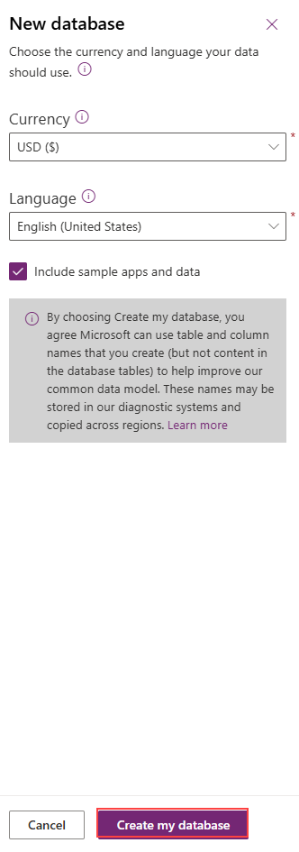

1. Once done, click on **Create with Excel or .CSV file**.

   

1. In the pop up window to create a environment, Click on **Create**. This will create a new power platform developer environment.

   
   >Note: If you are directly navigated to **Import an Excel or .CSV file pane**, please cancel the process.

1. Once done, select **Tables (1)** from the left menu and click on **Create with Excel or .CSV file (2)**.

   

1. In the next pane, click on **Select from device** and in the pop-up window to select files, navigate to `C:\Datasets\Store-Operations-with-Copilot-Studio-lab-datasets`, select **Product_catalogue.csv**.

   

1. Once selected, click on **Save and exit** and in the pop up window, click on **Save and exit**.

   

   

1. Again, select **Tabes (1)** from the left menu and click on **Create with Excel or .CSV file (2)**.

   

1. In the next pane, click on **Select from device** and in the pop-up window to select files, navigate to `C:\Datasets\Store-Operations-with-Copilot-Studio-lab-datasets`, select **Sample_orders.csv**.

   

1. Once selected, click on **Save and exit** and in the pop up window, click on **Save and exit**.

   

   

   

1. As you have now created a new environment and set up Dataverse, navigate to **Copilot Studio**  in a new tab using this link: [copilot studio](https://go.microsoft.com/fwlink/p/?linkid=2252408&clcid=0x409&culture=en-us&country=us)
   
1. In the pop-up window that appears click on **Start Free Trial**

     

1. If the **Welcome to Copilot Studio** prompt appears, click **Skip**.

1. Once you are inside **Copilot Studio** you will be in the home page. 

   

1. In the home page, select the environment option as shown.

   

1. Change the environment to the new environment that you have created earlier. Keep the tab open as you will be using this in further exercises.

   

## Task 2 : Setting up ServiceNow for incident management

In this task, you will set up and configure a ServiceNow instance to enable automated incident management for your store operations agent.

**ServiceNow** is a cloud-based platform that provides enterprise workflow automation solutions to streamline and manage business processes. It offers tools for IT service management (ITSM), IT operations management (ITOM), and IT business management (ITBM), enabling organizations to improve efficiency, reduce manual tasks, and enhance collaboration across departments. ServiceNow's centralized platform allows for incident tracking, service requests, change management, and integration with various third-party tools. Now you will set up the servicenow account.

1. Navigate to [ServiceNow Developer Portal](https://developer.servicenow.com/dev.do) using a new tab in your browser.

1. Once you are in the portal, select **Sign up and Start Building**.

    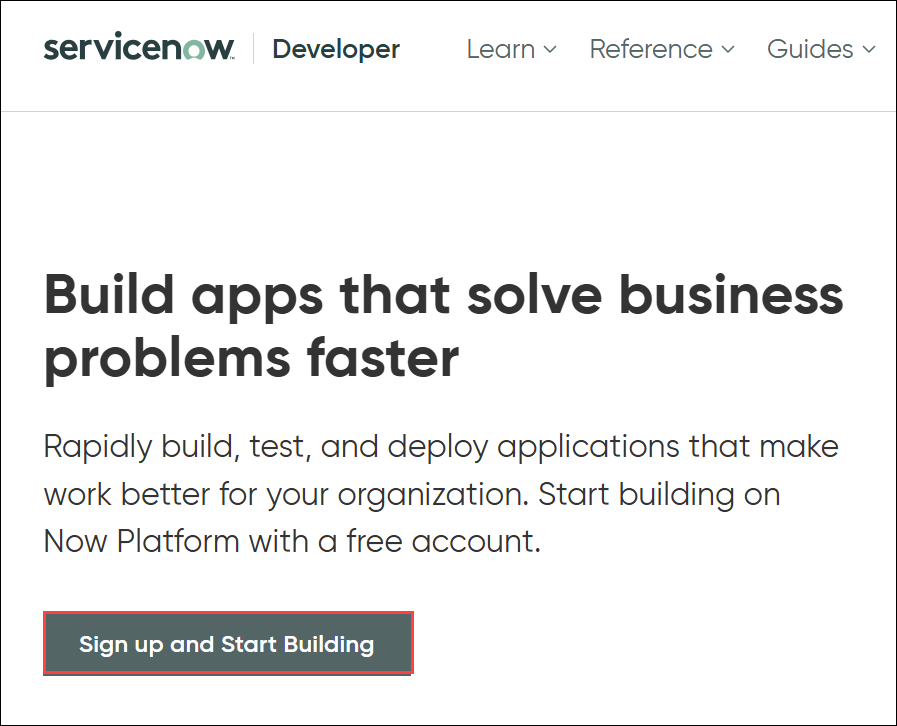

1. Now you will be navigated to **Sign Up** page. Please fill up the details and click on **Sign Up**.

    

    > **Note:** For the details, you can use your own credentials to sign up for servicenow account.

1. Once after signing up, you will get a verification mail to the account which you have provided.

    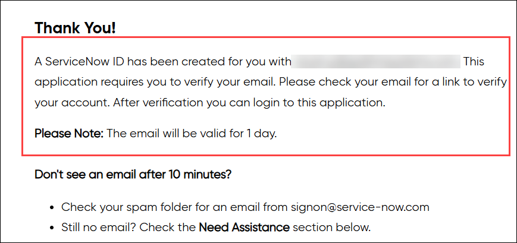

1. Please click on **verify Email**, and login using your credentials.

    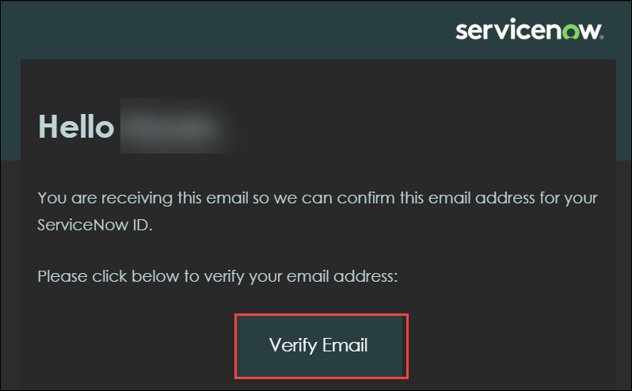

1. Once verified, you will be navigated to ServiceNow developer portal.

1. In the **Do you code ?** pop up, select **No** and click on **Next**. In the next pane, **Enable** the checkbox for I have read and agree to the ServiceNowDeveloper site terms of use and then click on **Finish Setup**.

    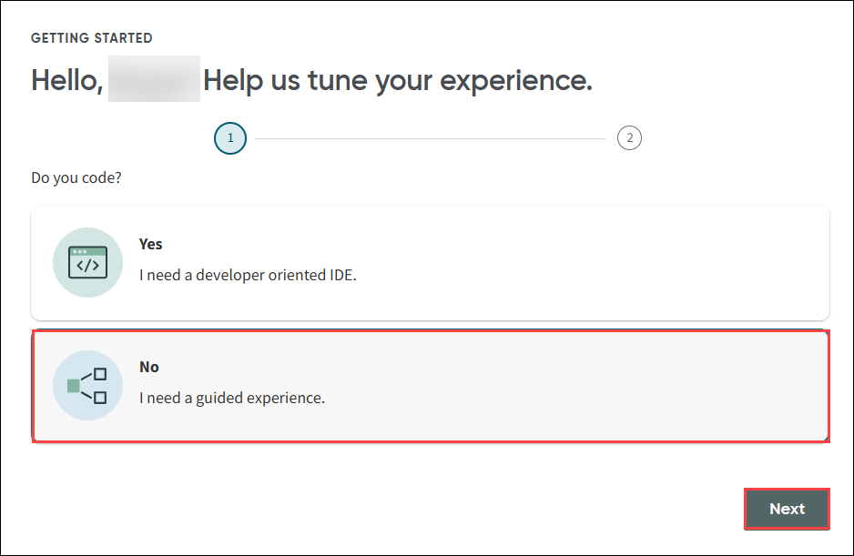

1. From the navigation menu of developer portal, click on **Request Instance**.

    

1. On the **Request an Instance** pane, select **Xanadu (1)** release and click on **Request (2)**

    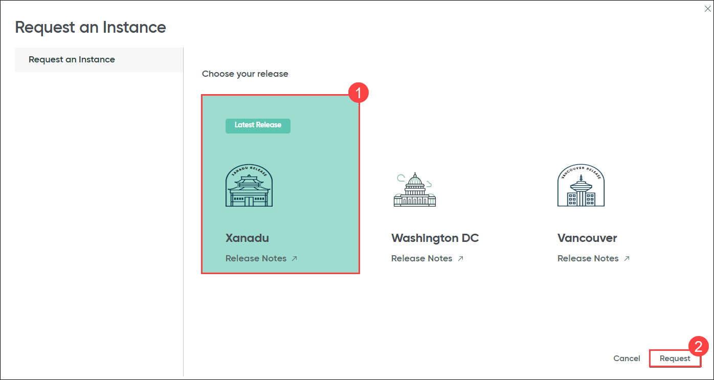

    >**Note:** It will take few minutes to get the instance allocated.

1. Once the instance is allocated, click on your profile.

    

1. Now, you have to assign the user with **Admin** role. To do that, click on **<> Change User Role** option.

    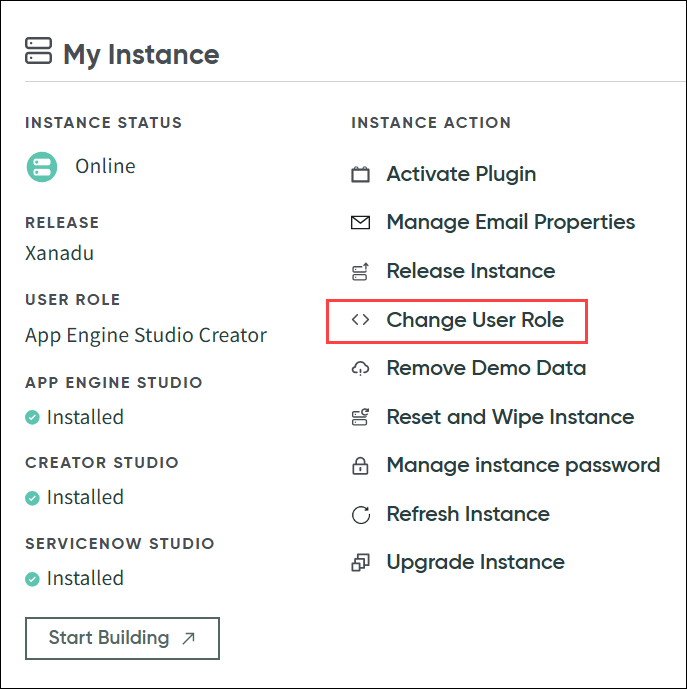

1. In **Change User Role** page, select **Admin** and Click on **Change User Role**.

    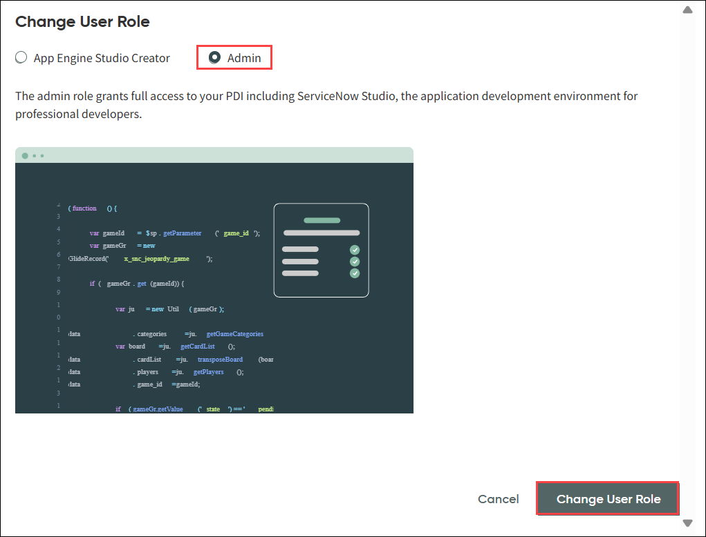

1. Once the role is set to admin, again from the profile menu, select **Manage instance password**.

    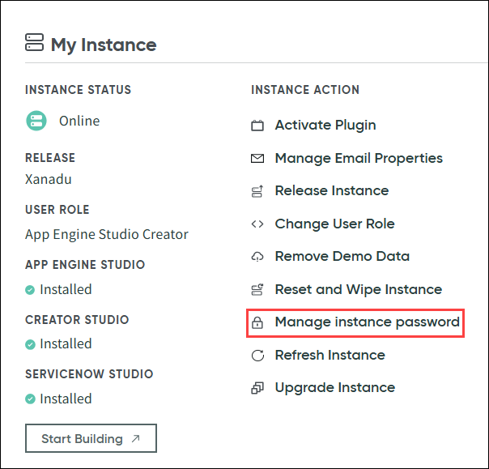

1. In the **Manage Instance password** pane, copy `Instance URL` **(1)**, `Username` **(2)** and `Password` **(3)** values to your notepad. You will be using these values further in this task.

    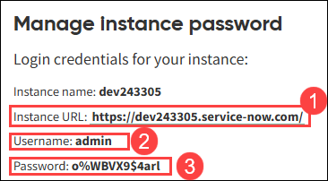

1. Navigate back to the home page of **Developer Portal**.

1. From the home page, click on **Start Building** option.

    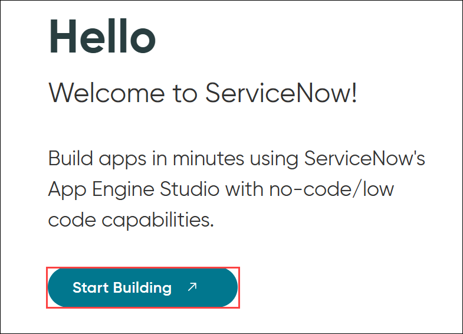

1. Now you will be navigated to creator portal. From the navigation menu, select **All (1)** and click on **Incidents (2)** from the dropdown.

    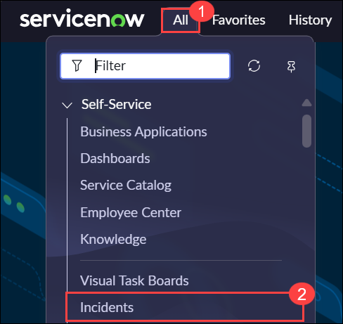

1. Once you are in the **Incidents** pane, click on **View: Self Service** option to remove the filters.

    

1. Now from the options, select **View** as **Default View** and **Filters** as **--None--**.

    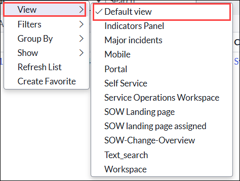

    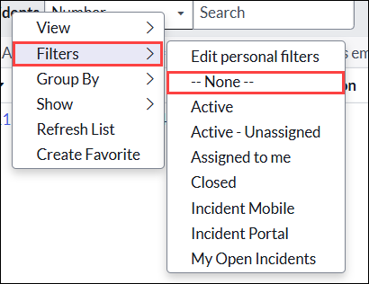

1. Now, you will be able to see all the incidents that are reported. The incidents which are already present are the demo incidents which are present by default.

    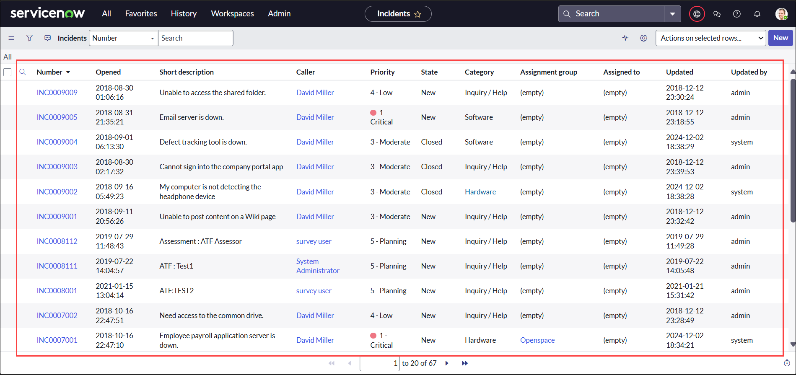

1. Now the ServiceNow is completly setup to get the incidents from Store Operations Agent.

## Summary

In this exercise, you provisioned a Power Platform environment—enabled Dataverse and the Copilot Studio trial. You also set up and configured a ServiceNow instance to handle incident management. Together, these foundational steps established the infrastructure needed to build and deploy your RAG-driven store operations agent.

### You have successfully completed this exercise, please continue to next one >>
