# Exercise 1: Setting up Pre-Requisites for Store operations Agent

### Estimated Duration: 45 Minutes

## Overview

In this exercise, you will provision a Power Platform environment—enabling Dataverse, Azure AI services, and the Copilot Studio trial. You will also set up and configure zendesk to handle incident management. Together, these foundational steps establish the infrastructure needed to build and deploy your RAG‑driven store operations agent.

## Objectives

You will be able to complete the following tasks:

- Task 1 : Provisioning power platform environmnet

- Task 2 : Setting up zendesk for incident management

## Task 1 : Provisioning power platform environmnet

1. Navigate to [Power Apps](https://make.powerapps.com/) using a new tab in the browser.

1. Inside power apps portal, select **Tables (1)** from the left menu and click on **Create a database (2)**.

   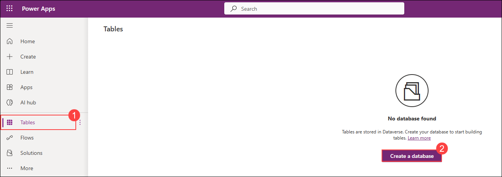

1. In the new pane for creating New Database, click on **Create my Database**.

   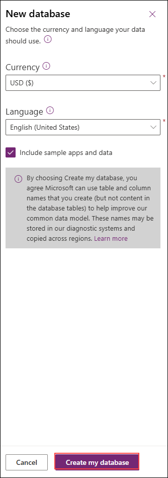

1. Once done, click on **Create with Excel or .CSV file**.

   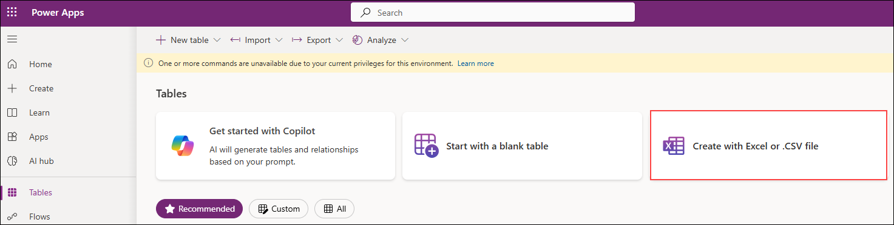

1. In the pop up window to create a environment, Click on **Create**. This will create a new power platform developer environment.

   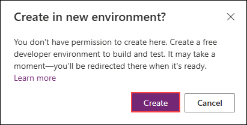
   >Note: If you are directly navigated to **Import an Excel or .CSV file pane**, please cancel the process.

1. Once done, select **Tables (1)** from the left menu and click on **Create with Excel or .CSV file (2)**.

   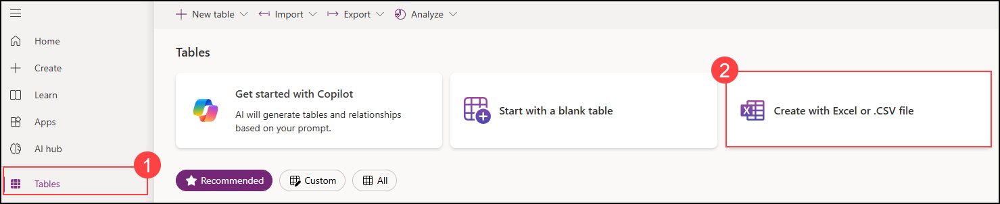

1. In the next pane, click on **Select from device** and in the pop-up window to select files, navigate to `C:\datasets\Store-Operations-with-Copilot-Studio-lab-datasets`, select **Product_catalogue.csv**.

   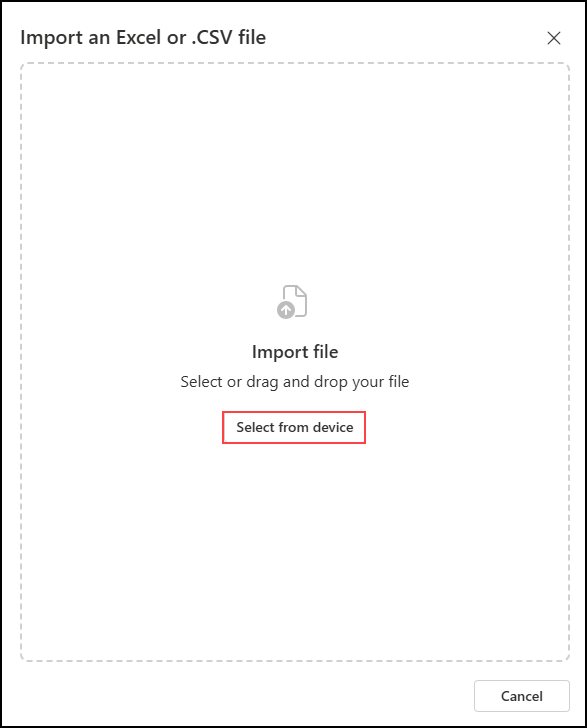

1. Once selected, click on **Save and exit** and in the pop up window, click on **Save and exit**.

   

   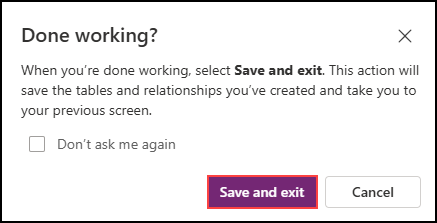

1. Again, select **Tabes (1)** from the left menu and click on **Create with Excel or .CSV file (2)**.

   

1. In the next pane, click on **Select from device** and in the pop-up window to select files, navigate to `C:\datasets\Store-Operations-with-Copilot-Studio-lab-datasets`, select **Sample_orders.csv**.

   

1. Once selected, click on **Save and exit** and in the pop up window, click on **Save and exit**.

   

   

   

1. As you have now created a new environment and set up Dataverse, navigate to **Copilot Studio**  in a new tab using this link: [copilot studio](https://go.microsoft.com/fwlink/p/?linkid=2252408&clcid=0x409&culture=en-us&country=us)
   
1. In the pop-up window that appears click on **Start Free Trial**

   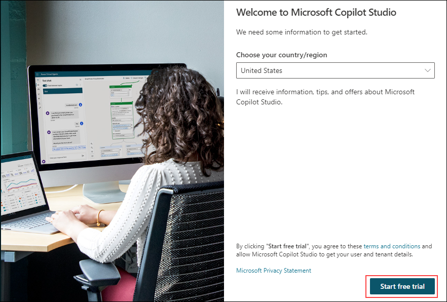

1. If the **Welcome to Copilot Studio** prompt appears, click **Skip**.

1. Once you are inside **Copilot Studio** you will be in the home page. 

   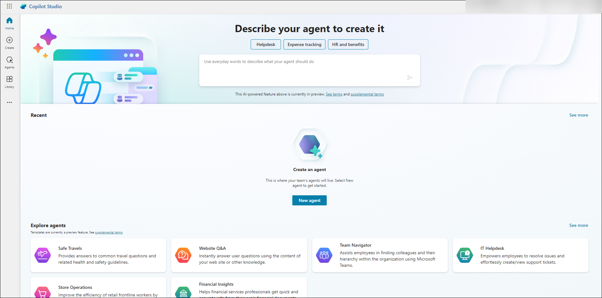

1. In the home page, select the environment option as shown.

   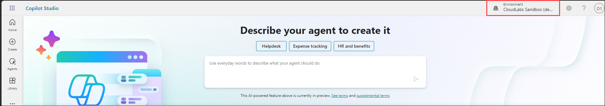

1. Change the environment to the new environment that you have created earlier. Keep the tab open as you will be using this in further exercises.

   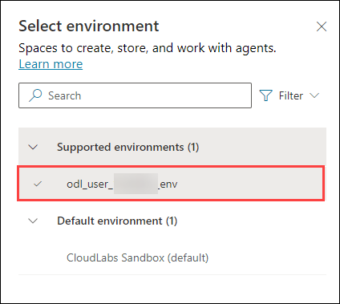

## Task 2 : Setting up zendesk for incident management

In this task, you will set up and configure zendesk to enable automated incident management for your store operations agent.

**Zendesk** is a cloud-based customer service and engagement platform designed to improve customer support operations and enhance user satisfaction. It offers a suite of tools for ticket management, live chat, help center creation, and customer self-service. Zendesk supports omnichannel communication, enabling businesses to manage customer interactions across email, chat, phone, and social media from a centralized interface. Its automation features help streamline workflows, assign tickets, and provide analytics for performance tracking. Now you will set up the Zendesk account.

1. Navigate to [Zendesk Portal](https://www.googleadservices.com/pagead/aclk?sa=L&ai=DChsSEwjbjIaHh8GNAxUfi7kFHWltF80YACICCAEQARoCdG0&co=1&gclid=EAIaIQobChMI24yGh4fBjQMVH4u5BR1pbRfNEAAYAiAAEgI3qvD_BwE&ohost=www.google.com&cid=CAASJeRozdrFK5n5mqcvpdaujD2HlLH524rvNzYIn6bFLaPbbXX2vcQ&sig=AOD64_2ES2d8GYvQCxT77uWXGF2XHo1E-g&q&adurl&ved=2ahUKEwjQnoGHh8GNAxWUoq8BHcQ6KTUQ0Qx6BAggEAE) using a new tab in your browser.

1. Once you are in the portal, under **Work email** add the value as **<inject key="AzureAdUserEmail"></inject>** and click on **Start your free trail**.

   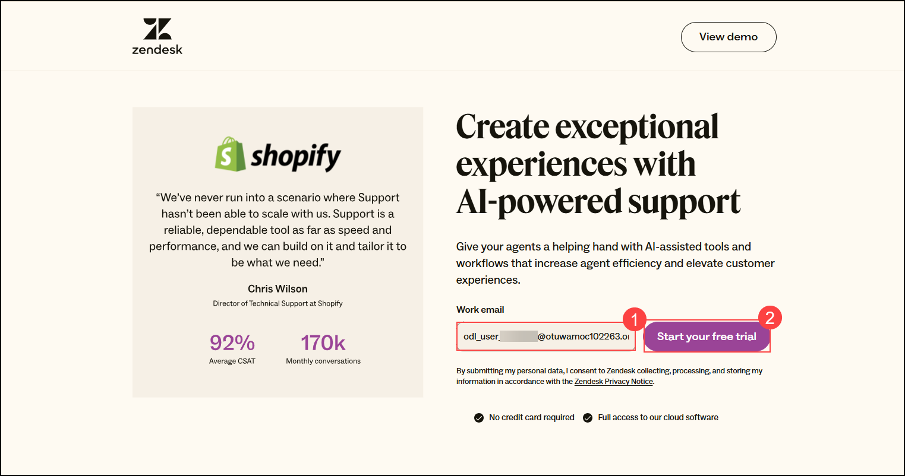

1. In the next pane, provide the first name as **ODL** and clik on next.

   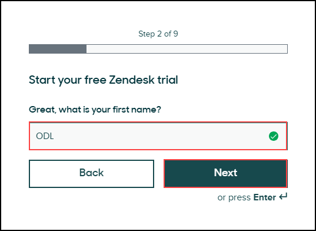

1. Next, provide last name as **User** and click on Next.

   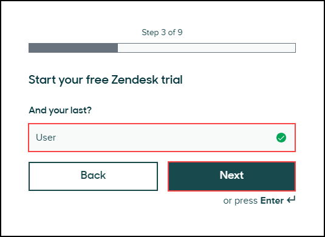

1. For **Phone number**, you can provide any 10 digit number as shown below and click on **Next**.

   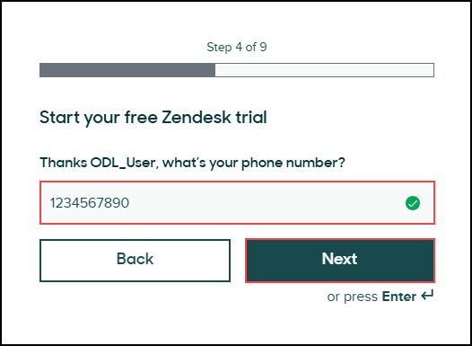

1. Provide company name as **Contoso** and click on **Next**.

   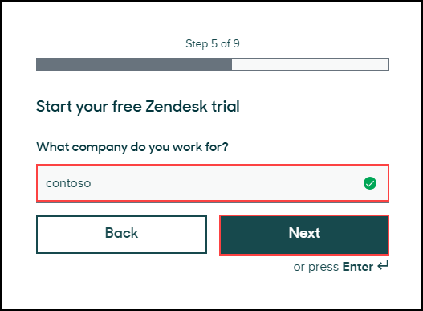

1. In the next pane, provide job title as **Cloud Engineer** or you can provide any job title here.

   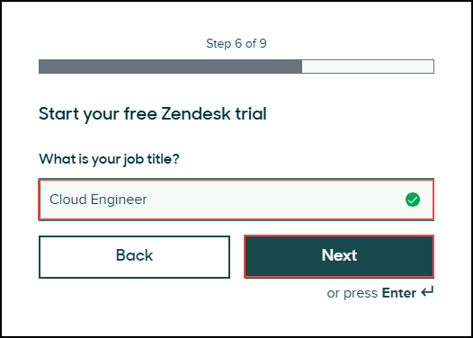

1. Next, select **1-9** from the drop down for the size of the company and click on **Next**.

   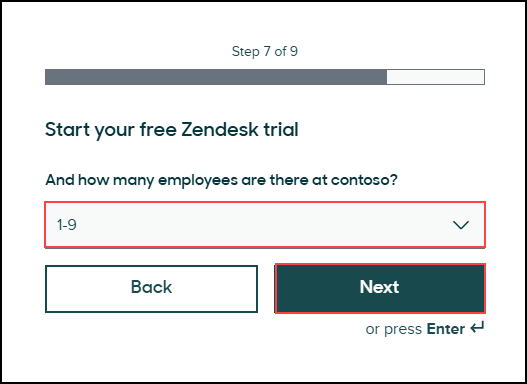

1. For **Language**, select **English** and click on Next.

   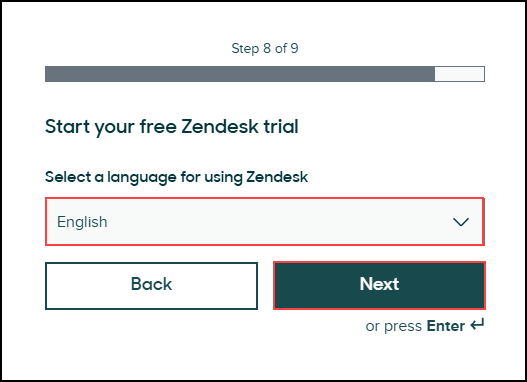

1. In the last pane, provide password as **<inject key="AzureAdUserPassword"></inject>** and click on **Complete trial signup**.

   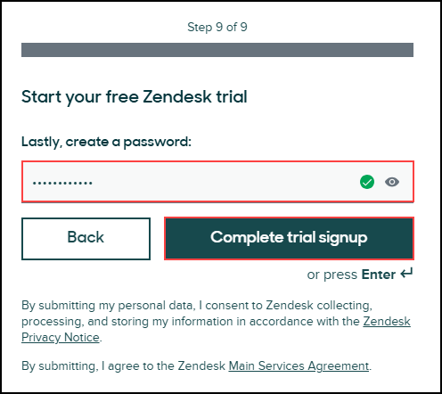

1. To verify the account, select **Open Outlook** option from the pop up.

   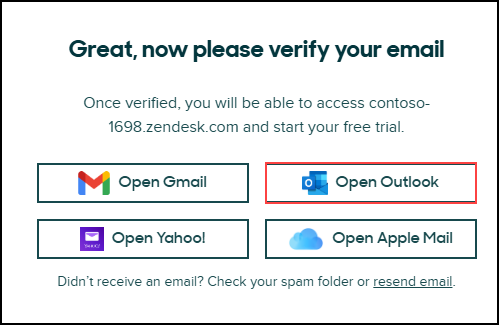

1. Once selected, you will be navigated to Outlook, complete the sign in and open the verification mail from ZenDesk. Click on **Verify your account**.

   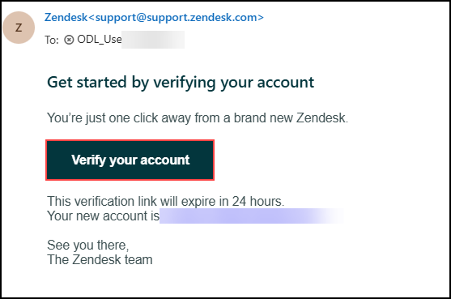

1. Again, you will be navigated to Zendesk portal. On **Welcome to your free trial** page, click on **Let's go ->**.

   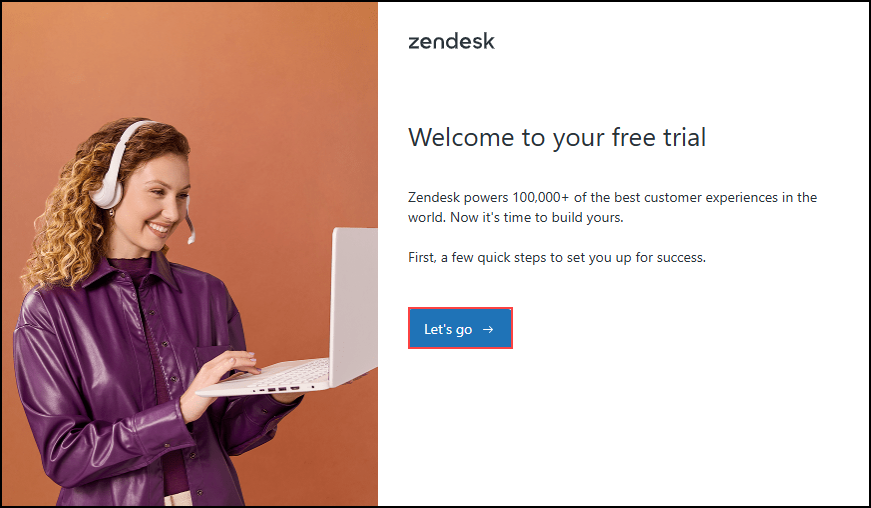

1. In the next pane, click on **Next**.

   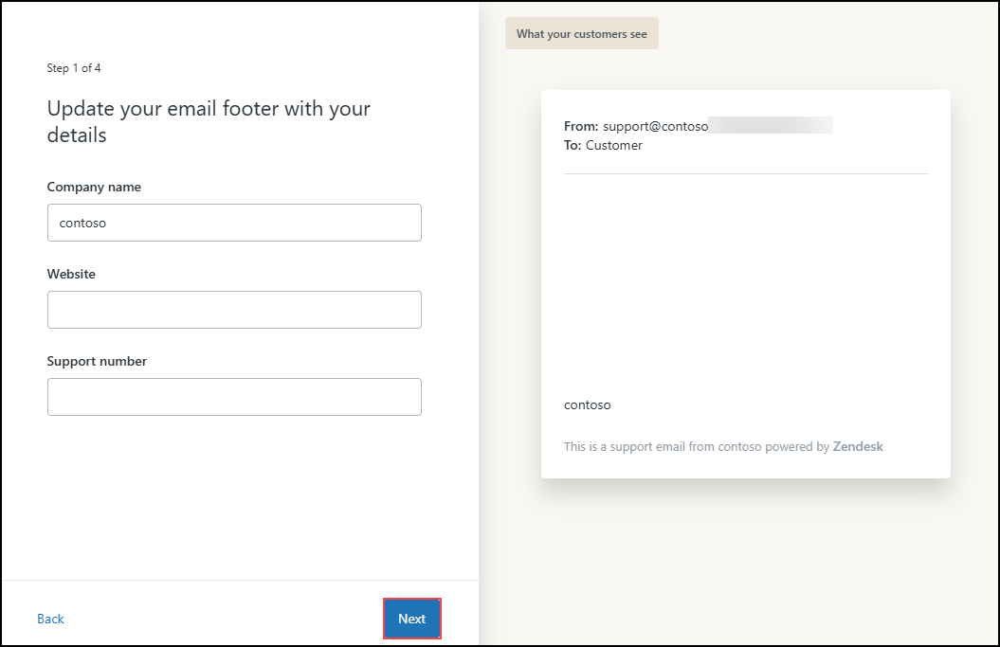

1. To skip auto-response setup, select **I don't want an auto-response** option.

   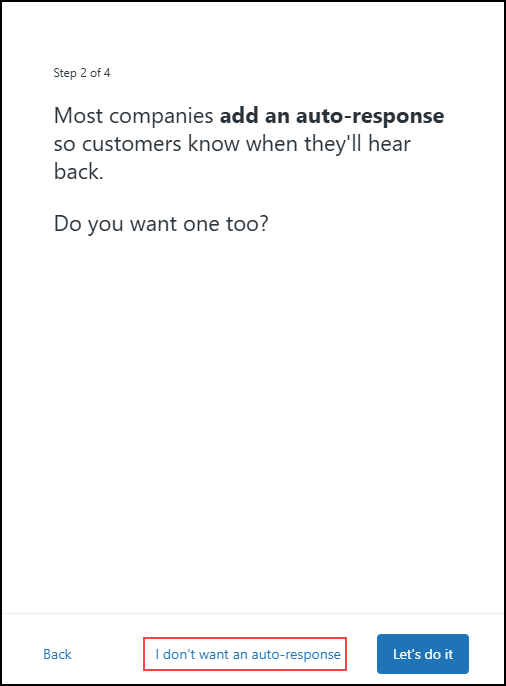

1. Next, click on **Skip** to skip the team invitation.

   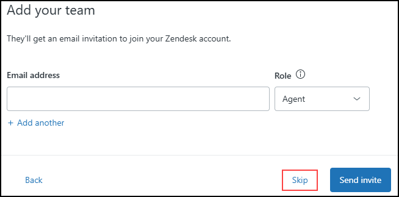

1. In the next pane to configure connector, click on **Skip**.

   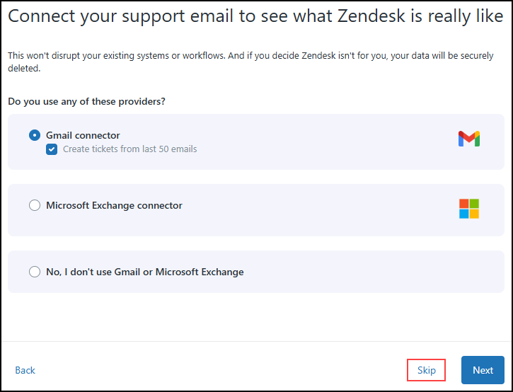

1. Next, click on **Solve a test ticket**. You will be navigated to a test ticket.

   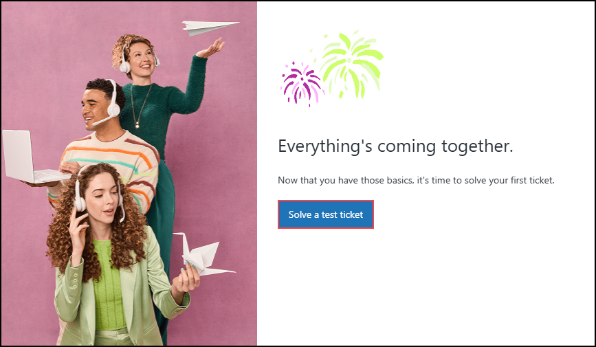

1. Once you are in the tickets portal, click on the **Home icon** from the left menu as shown. You will initially see sample test tickets displayed on this page. Once you configure the agent, any tickets generated by the agent will also appear here.

   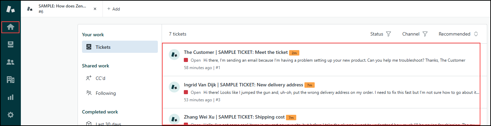

## Summary

In this exercise, you provisioned a Power Platform environment—enabled Dataverse and the Copilot Studio trial. You also set up and configured zendesk to handle incident management. Together, these foundational steps established the infrastructure needed to build and deploy your RAG-driven store operations agent.

### You have successfully completed this exercise, please continue to next one >>
