# Exercise 1: Setting up Pre-Requisites for Store operations Agent

### Estimated Duration: 45 Minutes

## Overview

In this exercise, you will provision a Power Platform environment, enable Dataverse and the Copilot Studio trial. You will also create and configure a SharePoint IT HelpDesk site to handle incident management. These steps set up the infrastructure needed to build and deploy your store operations agent.

## Objectives

You will be able to complete the following tasks:

- Task 1 : Provisioning power platform environment

- Task 2 : Setting up SharePoint IT HelpDesk for incident management

## Task 1 : Provisioning power platform environment

In this task, you will ingest the datasets to dataverse, which will be created in new power platform environment.

1. Navigate back to Power Apps portal, please switch to the environment that you created earlier.

    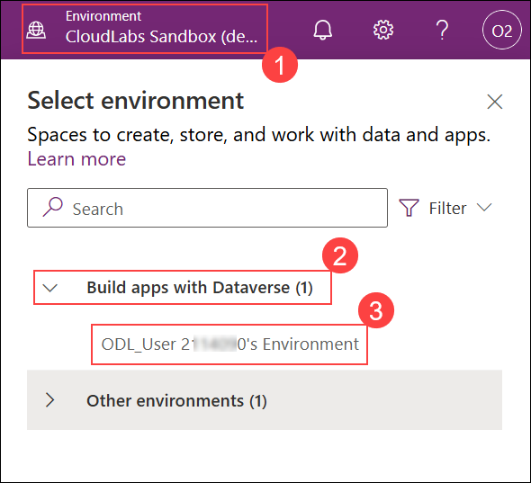

1. In the Power Apps portal, select **Tables (1)** from the left menu and select **Create a database (2)**.

   

   >**Note:** If you are not able to see **Create Database** option and you are able to see some tables already, please continue from **Step 4**.

1. In the new pane for creating a new database, select **Create my Database**.

   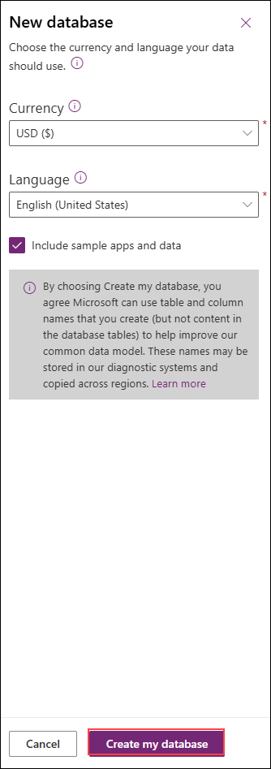

1. Once done, select **Create with Excel or .CSV file**.

   

1. In the pop-up window to create an environment, select **Create**. This will create a new Power Platform developer environment.

   
   
   >Note: If you are directly navigated to **Import an Excel or .CSV file pane**, please cancel the process.

1. In the next pane, select **Select from device**.

   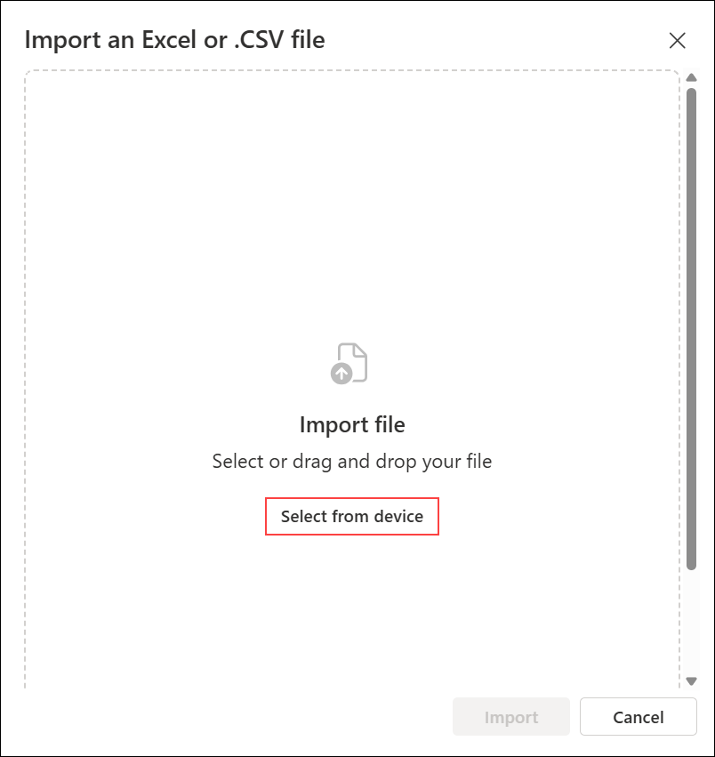

1. On the **Open** window, navigate to the folder `C:\datasets\Store-Operations-with-Copilot-Studio-lab-datasets` **(1)**.  
Select the file **product_catalog.csv (2)** and select **Open (3)**.

   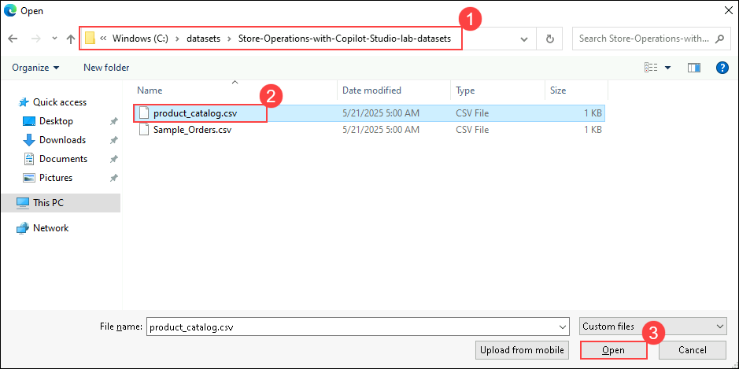

1. Once selected, select **Import**.

   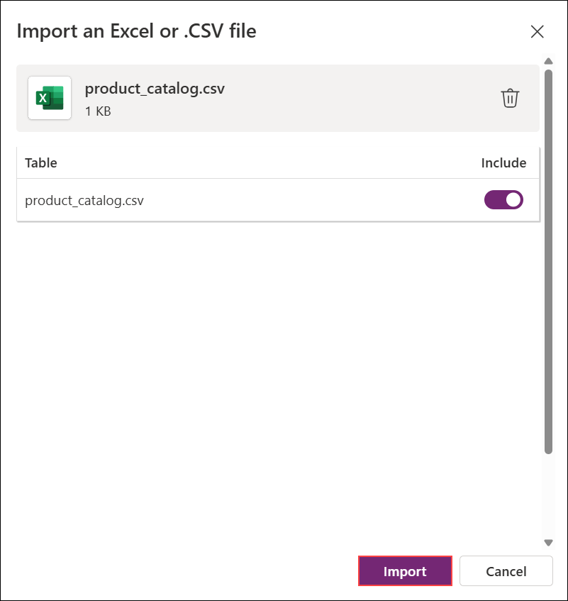

1. Select **Save and exit**, and in the pop-up window, select **Save and exit**.

   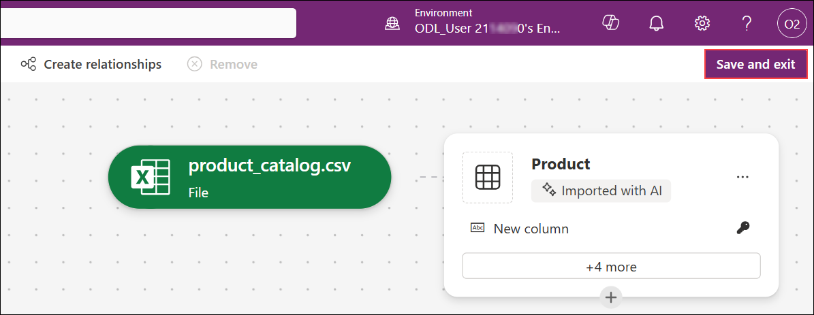

   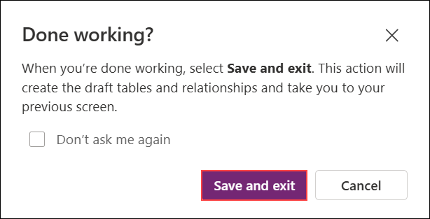

   >**Note:** If you are not able to find **Save and exit** button, minimize the screen using **CTRL + -**.
   >**Note:** If you are seeing **Create** option instead of **Save and Exit**, please go with the Create option.

1. Again, select **Tables (1)** from the left menu and select **Create with Excel or .CSV file (2)**.

   

1. In the next pane, select **Select from device** and in the pop-up window to select files, navigate to `C:\datasets\Store-Operations-with-Copilot-Studio-lab-datasets`, select **Sample_orders.csv**.

   

1. Once selected, select **Import**.

   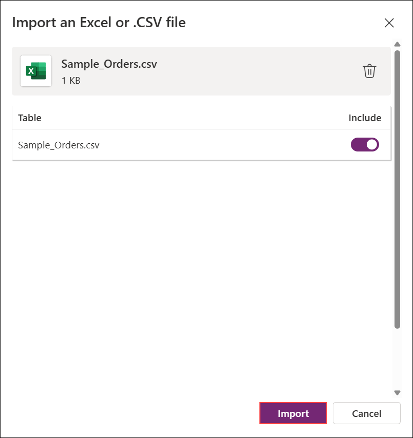

1. Select **Save and exit**, and in the pop-up window, select **Save and exit**.

   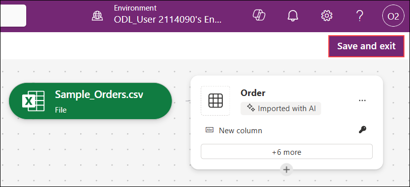

   

1. Navigate to **Microsoft Copilot Studio** by opening a new browser tab and entering the following URL:

   ```
   https://copilotstudio.microsoft.com
   ```

1. On the **Welcome to Microsoft Copilot Studio** screen, keep the default **country/region** selection and select **Get Started** to continue.

   

1. If the **Welcome to Copilot Studio!** pop-up appears, select **Skip** to continue to the main dashboard.

   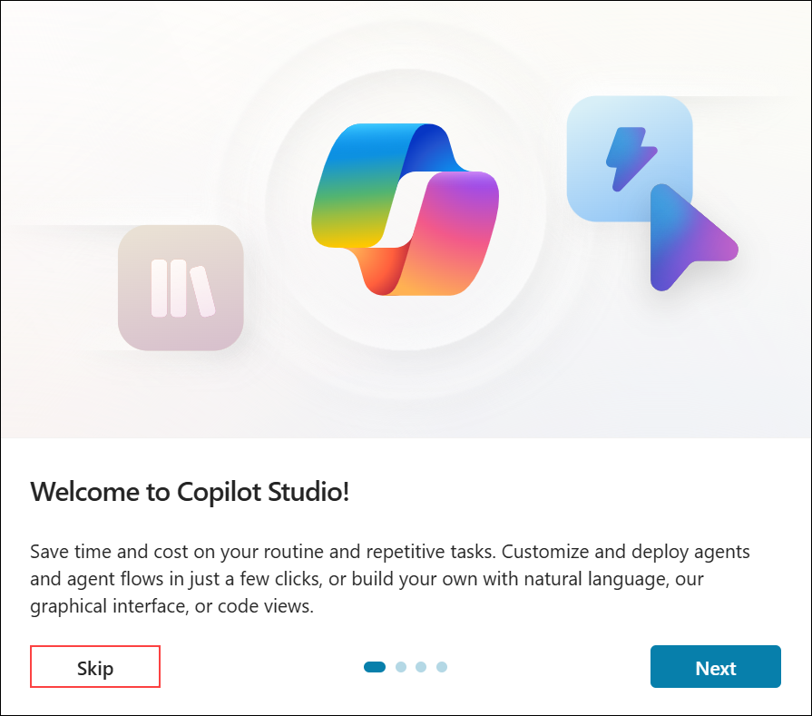

1. If the **We've updated you to the latest version of Microsoft Copilot Studio** pop-up appears, select **Got it!**.

   

1. If the **What's new in Copilot Studio** pop-up appears, select the **Close (X)** icon to dismiss it.

   

1. In Copilot Studio, open the environment picker **(1)**, expand **Supported environments (2)**, and select **ODL_User <inject key="Deployment ID" enableCopy="false"></inject>'s Environment (3)** to switch.

   

1. Once you are in **Copilot Studio**, you will be on the home page.

   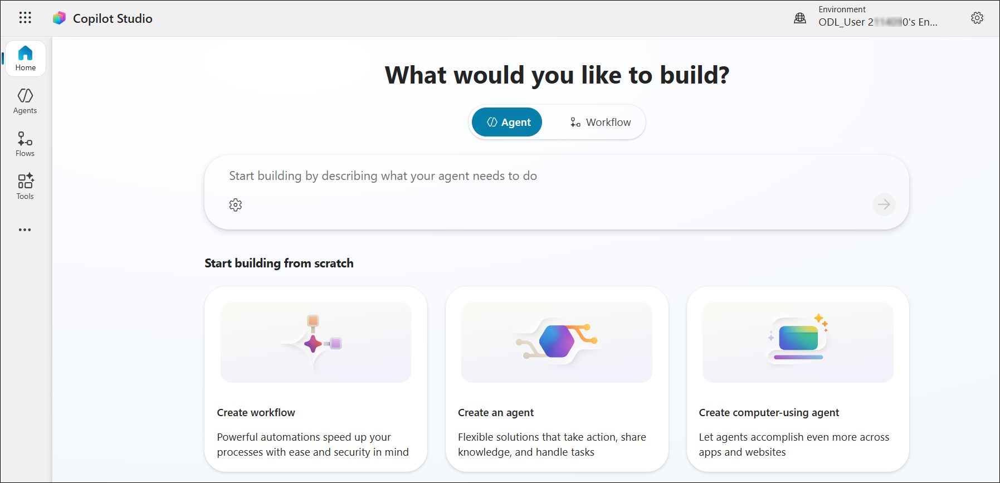

## Task 2: Setting up SharePoint IT HelpDesk for incident management

In this task, you will create a SharePoint IT HelpDesk site using the built-in IT help desk template. This site includes a **Tickets** list (issue tracker) and an asset manager list. You will use the **Tickets** list to create and track support tickets from your Copilot Studio agent using the SharePoint connector in Power Automate.

1. In a new browser tab, navigate to MyApps portal using the below link.

   ```
   https://myapps.microsoft.com
   ```

1. In the next pane, select **SharePoint** icon.

   

   > **Note:** If you are not able to see SharePoint in the MyApps section, navigate to `https://cloudlabssandbox.sharepoint.com/` directly to access SharePoint.

1. Close the pop-up window.

   

1. Once navigated to SharePoint, select **+ Create site** option.

   

1. In the next page, select **Team site**.

   

1. From the available templates, select **IT help desk** template.

   

1. In the IT Helpdesk template page, select **Use template**.

   

1. In the configuration pane, provide the following name. Copy the **Site Address** as you will be using this further in the exercises. Select **Next**.

   ```
   Store-OP-<inject key="Deployment ID" enableCopy="false"></inject>
   ```

   

1. Under privacy settings, leave it as **Private** and select **Create site**.

   

1. In the final pane, please wait till the **Finish** button is enabled and then select **Finish**. This may take up to 5 minutes.

   

1. Once created, the page will look similar to this.

   

1. From the left navigation or the site contents, locate and select the **Tickets** list.

   > **Note:** The IT HelpDesk template comes with a **Tickets** list (issue tracker) that includes columns such as **Title**, **Issue Description**, **Priority**, and **Status**. This is the list where your agent will create support tickets.

1. Copy the **Site Address** (for example, `https://cloudlabssandbox.sharepoint.com/sites/Store-OP-XXXXXX`) from the browser address bar and save it securely for later use.

   > This is your **SharePoint HelpDesk Site Address** which you will need in Exercise 3 when configuring the agent flow.

1. You should now have the following value saved:
   - **Site Address:** `https://cloudlabssandbox.sharepoint.com/sites/Store-OP-<inject key="Deployment ID" enableCopy="false"></inject>`

1. Now you have successfully verified the SharePoint IT HelpDesk for ticket management.

<validation step="9ec40b7e-aa69-4359-a1f4-833d8ca8d8b4" />
 
> **Congratulations** on completing the task! Now, it's time to validate it. Here are the steps:
> - Hit the Validate button for the corresponding task. If you receive a success message, you can proceed to the next task. 
> - If not, carefully read the error message and retry the step, following the instructions in the lab guide.
> - If you need any assistance, please contact us at cloudlabs-support@spektrasystems.com. We are available 24/7 to help.

## Summary

In this exercise, you provisioned a Power Platform environment, enabled Dataverse and the Copilot Studio trial, and set up the SharePoint IT HelpDesk site for incident management. These steps established the infrastructure needed to build and deploy your store operations agent.

### You have successfully completed this exercise, please continue to next one >>


