# Exercise 1: Setting up Pre-Requisites for Store operations Agent

### Estimated Duration: 45 Minutes

## Overview

In this exercise, you will provision a Power Platform environment—enabling Dataverse, Azure AI services, and the Copilot Studio trial. You will also set up and configure Freshworks to handle incident management. Together, these foundational steps establish the infrastructure needed to build and deploy your RAG‑driven store operations agent.

## Objectives

You will be able to complete the following tasks:

- Task 1 : Provisioning power platform environment

- Task 2 : Setting up Freshworks for incident management

## Task 1 : Provisioning power platform environment

In this task, you will ingest the datasets to dataverse, which will be created in new power platform environment.

1. Navigate back to Power Apps portal, please switch to the environment to the environmnet that you created earlier.

    

1. Inside power apps portal, select **Tables (1)** from the left menu and click on **Create a database (2)**.

   

   >**Note:** If you are not able to see **Create Database** option and you are able to see some tables already, please continue from **Step 3**.

1. In the new pane for creating New Database, click on **Create my Database**.

   

1. Once done, click on **Create with Excel or .CSV file**.

   

1. In the pop up window to create a environment, Click on **Create**. This will create a new power platform developer environment.

   
   
   >Note: If you are directly navigated to **Import an Excel or .CSV file pane**, please cancel the process.

1. Once done, select **Tables (1)** from the left menu and click on **Create with Excel or .CSV file (2)**.

   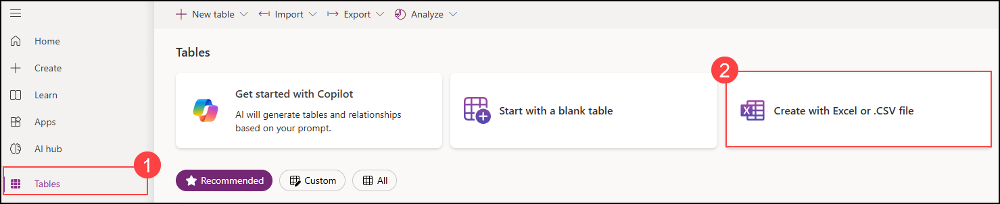

1. In the next pane, click on **Select from device**.

   

1. On the **Open** window, navigate to the folder `C:\datasets\Store-Operations-with-Copilot-Studio-lab-datasets` **(1)**.  
Select the file **product_catalog.csv (2)** and click the **Open (3)** button.

   

1. Once selected please click on **Import**.

1. Click on **Save and exit** and in the pop up window, click on **Save and exit**.

   

   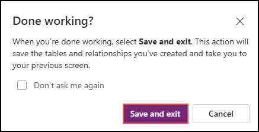

   >**Note:** If you are not able to find **Save and exit** button, minimize the screen using **CTRL + -**.
   >**Note:** If you are seeing **Create** option instead of **Save and Exit**, please go with the Create option.

1. Again, select **Tabes (1)** from the left menu and click on **Create with Excel or .CSV file (2)**.

   

1. In the next pane, click on **Select from device** and in the pop-up window to select files, navigate to `C:\datasets\Store-Operations-with-Copilot-Studio-lab-datasets`, select **Sample_orders.csv**.

   

1. Once selected please click on **Import**.

1. Click on **Save and exit** and in the pop up window, click on **Save and exit**.

   

   

   

1. As you have now created a new environment and set up Dataverse, navigate to **Copilot Studio**  in a new tab using this link: [copilot studio](https://go.microsoft.com/fwlink/p/?linkid=2252408&clcid=0x409&culture=en-us&country=us)

   >Note: Since you are working within a VM, please copy the above link and open it in the browser inside the VM.
   
1. In the pop-up window that appears click on **Get Started**

   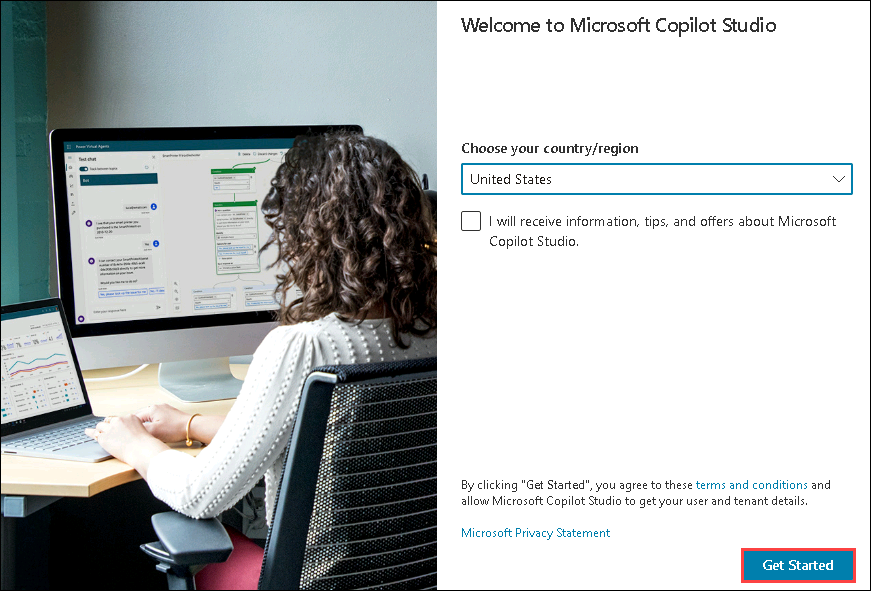

   >**Note:** If the Copilot Studio portal is taking longer than usual to load, please wait a few minutes. Alternatively, try closing your browser and reopening the portal in a private/incognito window. If still the issue persists,followthe below instructions to resolve this:

   > Navigate back to Power Apps Portal, and copy the environment ID as shown.

   

   > Once copied, navigate back to Copilot Studio, from the URL, replace the **Default** environment ID to the ID that you copied.

   

1. If the **Welcome to Copilot Studio** prompt appears, click **Skip**.

1. Once you are inside **Copilot Studio** you will be in the home page. 

   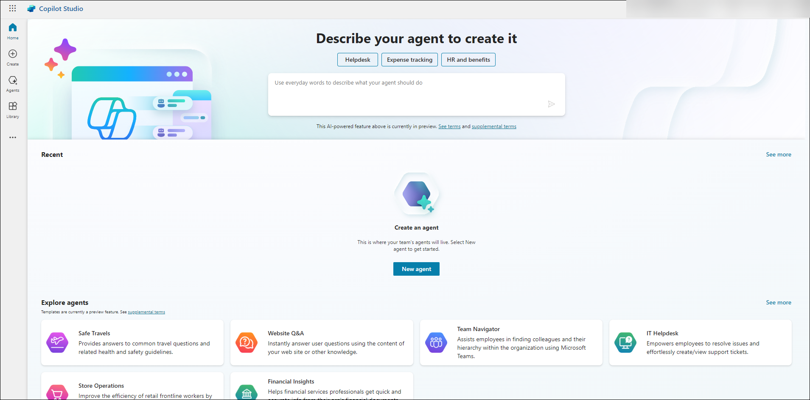

1. In the home page, select the environment option as shown.

   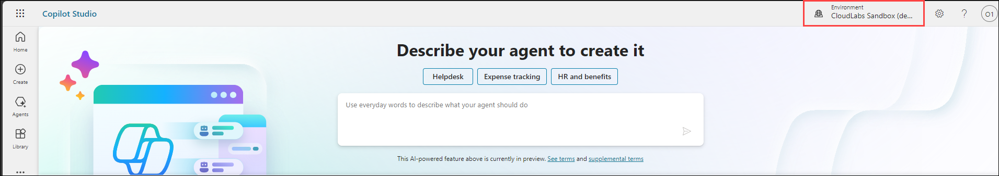

1. Change the environment to the new environment that you have created earlier. Keep the tab open as you will be using this in further exercises.

   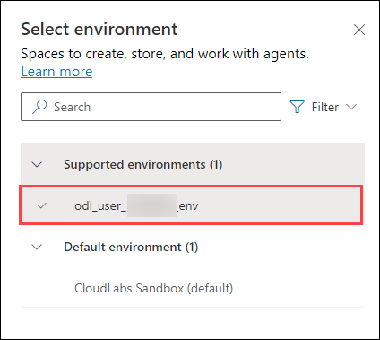

## Task 2: Setting up Freshworks for incident management

In this task, you will set up and configure Freshworks to enable automated incident management for your store operations agent.

**Freshworks** is a cloud-based customer service and engagement platform designed to improve customer support operations and enhance user satisfaction. It offers a suite of tools for ticket management, live chat, help center creation, and customer self-service. Freshworks supports omnichannel communication, enabling businesses to manage customer interactions across email, chat, phone, and social media from a centralized interface. Its automation features help streamline workflows, assign tickets, and provide analytics for performance tracking. Now you will set up the Freshworks account.

1. Open a new browser tab and navigate to:

   ```
   https://www.freshworks.com/freshdesk/
   ```

1. On the Freshdesk homepage, select **Try it free** to start creating your trial account.

   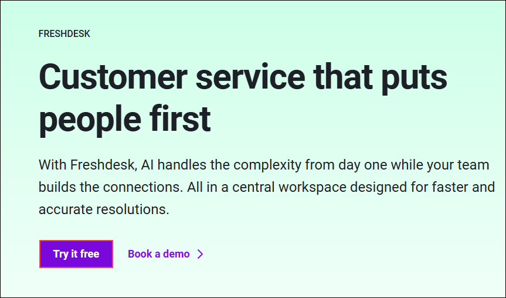

1. Fill in the registration form with the following details, accept the **Terms & Conditions**, and then select **Try it free**.

   | Field | Value |
   |-------|-------|
   | First name | **ODL User** |
   | Last name | **<inject key="DeploymentID"></inject>** |
   | Work email | **<inject key="AzureAdUserEmail" enableCopy="false"/>** |
   | Company name | **Contoso** |
   | Organization size | **11-50** |
   | Terms & Conditions | **Checked** |

   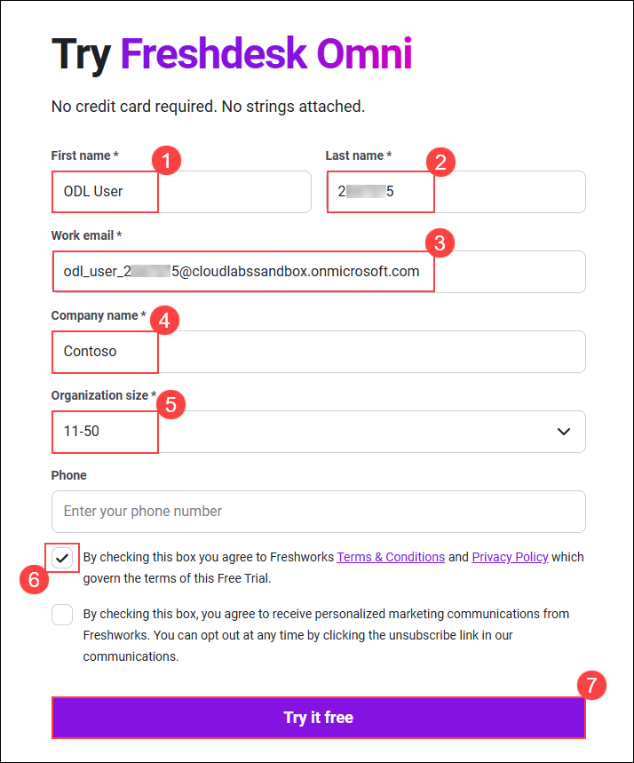

1. In your inbox, look for the **Freshworks verification email**.

   - Open a new tab and navigate to: `https://outlook.office.com`
   - Look for an email from Freshdesk with a subject like "Activate your account"

      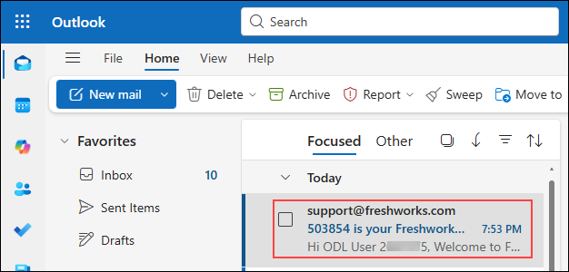

   > **Note:** If you are unable to locate the email from Freshworks, wait a few minutes as there might be a delay in email delivery. Also check your spam or junk folder.

1. Open the email. Depending on the email you received, follow **one** of the paths below:

   **Path A – Verification Code (most common):**

   1. Copy the **six-digit verification code** from the email.

      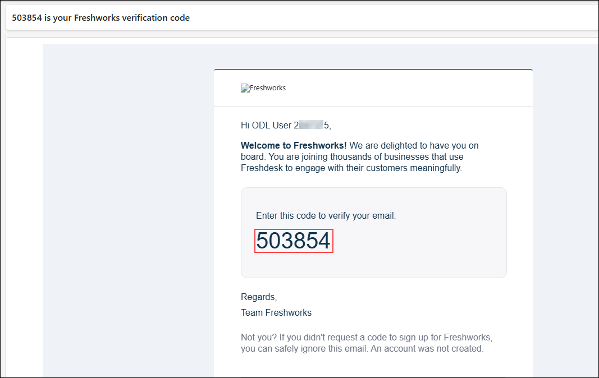

   1. Go back to the Freshworks sign-up tab and enter the code in the **Enter your verification code** fields.

      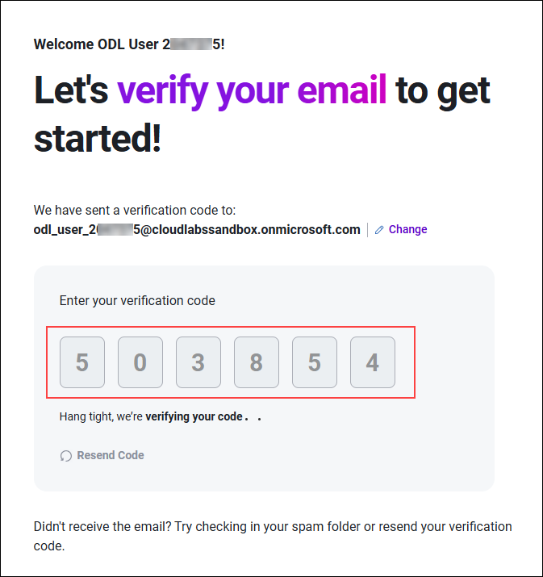

   1. If prompted with a CAPTCHA challenge, complete the verification by selecting the required images, and then click **VERIFY**.

   1. Enter the password **<inject key="AzureAdUserPassword"></inject>** in the **Password** field, and then click **Start my trial**.

      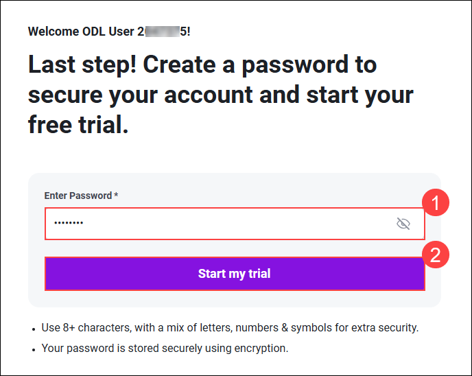

   **Path B – Activation Link:**

   > **Note:** If you received an activation link instead of a verification code, follow these steps.

   1. In the email, click **Activate Account**.

      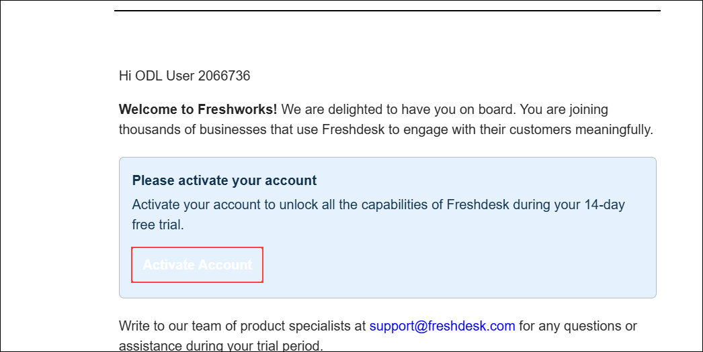

   1. On the activation page, enter **<inject key="AzureAdUserPassword"></inject>** in both the **Enter password** and **Confirm password** fields, and then click **Activate your account**.

      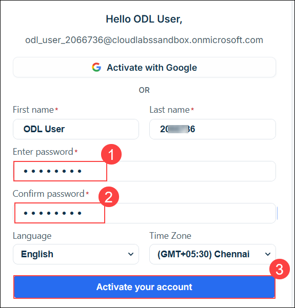

1. On the personalization page, confirm **Software and Internet (1)** as the industry, select **I’m trying customer service software for the first time (2)**, and then click **Next (3)**.

   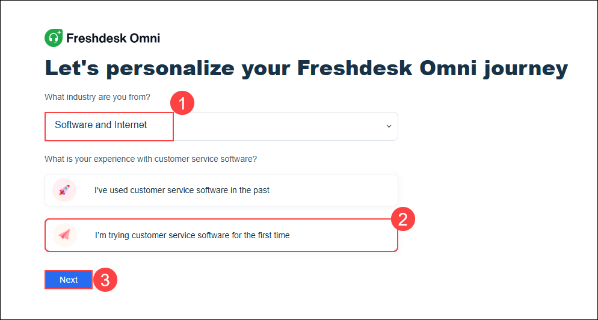

1. Wait for the Freshdesk portal to load. You should now be logged in to your Freshdesk dashboard.

1. From the left, click on **Tickets** icon from left menu, you can see some default tickets which are present.

   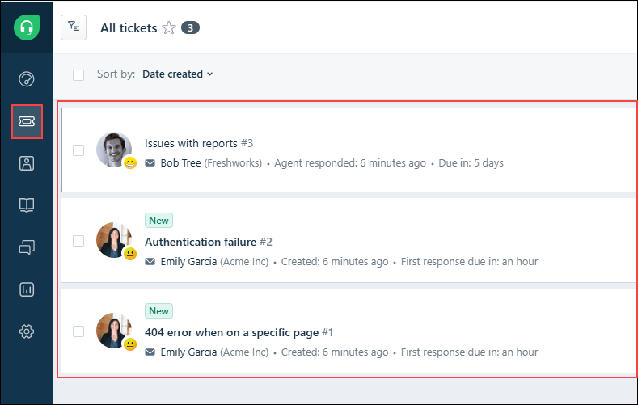

1. In the top-right corner, select your **profile icon (1)**, and then choose **Profile settings (2)** from the menu.

   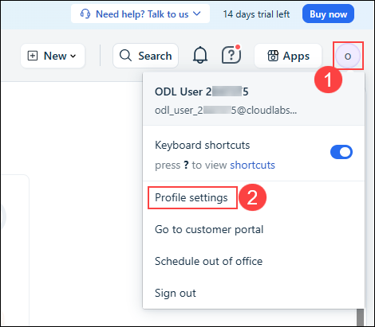

1. In **Profile settings**, select **View API Key** to display your API key.

   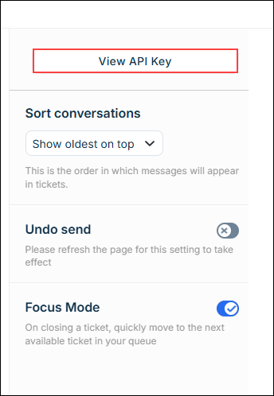

1. Under **Your API Key**, copy the displayed API key and save it securely for later use.

   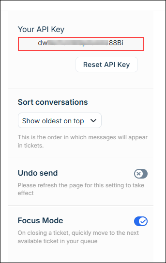

1. From the browser address bar, copy the **Account URL** (for example, `https://your-company-name.freshdesk.com`) and save it for use in the next task.

   

   >This is your **Account URL** which you will need in the later task.

1. You should now have two values saved:
   - **Account URL:** `https://your-company-name.freshdesk.com`
   - **API Key:** Your copied API key

1. Now you have successfully setup the freshworks for ticket management.

<validation step="9ec40b7e-aa69-4359-a1f4-833d8ca8d8b4" />
 
> **Congratulations** on completing the task! Now, it's time to validate it. Here are the steps:
> - Hit the Validate button for the corresponding task. If you receive a success message, you can proceed to the next task. 
> - If not, carefully read the error message and retry the step, following the instructions in the lab guide.
> - If you need any assistance, please contact us at cloudlabs-support@spektrasystems.com. We are available 24/7 to help.

## Summary

In this exercise, you provisioned a Power Platform environment—enabled Dataverse and the Copilot Studio trial. You also set up and configured Freshworks to handle incident management. Together, these foundational steps established the infrastructure needed to build and deploy your RAG-driven store operations agent.

### You have successfully completed this exercise, please continue to next one >>


