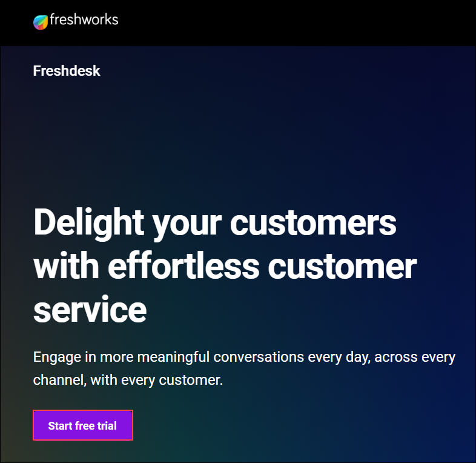
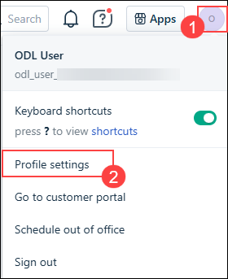
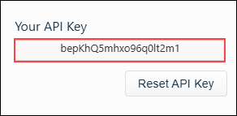
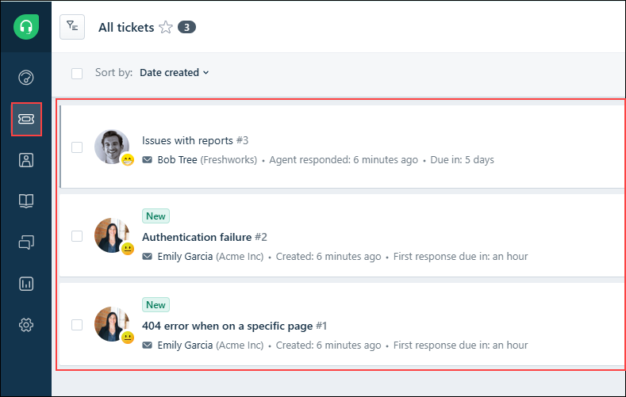

# Exercise 1: Setting up Pre-Requisites for Store operations Agent

### Estimated Duration: 45 Minutes

## Overview

In this exercise, you will provision a Power Platform environment—enabling Dataverse, Azure AI services, and the Copilot Studio trial. You will also set up and configure Freshworks to handle incident management. Together, these foundational steps establish the infrastructure needed to build and deploy your RAG‑driven store operations agent.

## Objectives

You will be able to complete the following tasks:

- Task 1 : Provisioning power platform environmnet

- Task 2 : Setting up Freshworks for incident management

## Task 1 : Provisioning power platform environmnet

1. Inside power apps portal, select **Tables (1)** from the left menu and click on **Create a database (2)**.

   

1. In the new pane for creating New Database, click on **Create my Database**.

   

1. Once done, click on **Create with Excel or .CSV file**.

   

1. In the pop up window to create a environment, Click on **Create**. This will create a new power platform developer environment.

   
   >Note: If you are directly navigated to **Import an Excel or .CSV file pane**, please cancel the process.

1. Once done, select **Tables (1)** from the left menu and click on **Create with Excel or .CSV file (2)**.

   

1. In the next pane, click on **Select from device** and in the pop-up window to select files, navigate to `C:\datasets\Store-Operations-with-Copilot-Studio-lab-datasets`, select **Product_catalogue.csv**.

   

1. Once selected, click on **Save and exit** and in the pop up window, click on **Save and exit**.

   

   

1. Again, select **Tabes (1)** from the left menu and click on **Create with Excel or .CSV file (2)**.

   

1. In the next pane, click on **Select from device** and in the pop-up window to select files, navigate to `C:\datasets\Store-Operations-with-Copilot-Studio-lab-datasets`, select **Sample_orders.csv**.

   

1. Once selected, click on **Save and exit** and in the pop up window, click on **Save and exit**.

   

   

   

1. As you have now created a new environment and set up Dataverse, navigate to **Copilot Studio**  in a new tab using this link: [copilot studio](https://go.microsoft.com/fwlink/p/?linkid=2252408&clcid=0x409&culture=en-us&country=us)
   
1. In the pop-up window that appears click on **Start Free Trial**

   

1. If the **Welcome to Copilot Studio** prompt appears, click **Skip**.

1. Once you are inside **Copilot Studio** you will be in the home page. 

   

1. In the home page, select the environment option as shown.

   

1. Change the environment to the new environment that you have created earlier. Keep the tab open as you will be using this in further exercises.

   

## Task 2 : Setting up Freshworks for incident management

In this task, you will set up and configure Freshworks to enable automated incident management for your store operations agent.

**Freshworks** is a cloud-based customer service and engagement platform designed to improve customer support operations and enhance user satisfaction. It offers a suite of tools for ticket management, live chat, help center creation, and customer self-service. Freshworks supports omnichannel communication, enabling businesses to manage customer interactions across email, chat, phone, and social media from a centralized interface. Its automation features help streamline workflows, assign tickets, and provide analytics for performance tracking. Now you will set up the Freshworks account.

1. Navigate to [Freshworks Portal](https://www.freshworks.com/freshdesk/lp/home/?tactic_id=3387224&utm_source=google-adwords&utm_medium=FD-Search-Brand-India&utm_campaign=FD-Search-Brand-India&utm_term=freshdesk&device=c&matchtype=e&network=g&gclid=EAIaIQobChMIuOK90qvLjQMV_dQWBR3JAi9VEAAYASAAEgK87_D_BwE&audience=kwd-30002131023&ad_id=282519464145&gad_source=1&gad_campaignid=671502402) using a new tab in your browser.

1. In the portal, select **Start free trial** to start the free trial.

   

1. In the next pane, provide these details and click on **Try it free (5)**:

   - **First name:** `ODL` **(1)**
   - **Last name:** `User` **(2)**
   - **Work email:** **<inject key="AzureAdUserEmail"></inject>** **(3)**
   - **Company name:** `Contoso` **(4)**

   

1. In the next pane, provide these details and click on **Next (4)**:

   - **What industry are you from ?:** from the list, select **Software and internet (1)**
   - **How many employees are there in your company?:** select **1-10 (2)**
   - select **I'm trying customer service software for the first time (3)**

   

1. Once done, navigate to [Outlook](https://go.microsoft.com/fwlink/p/?LinkID=2125442&clcid=0x409&culture=en-us&country=us).

1. In the pick an account pane, select the account which you are assigned for this lab.

   

1. In the freshworks verification email, open and click on **Activate Account**.

   

1. In the next pane, provide **<inject key="AzureAdUserPassword"></inject>** as **Enter password (1)** and provide the same password for **Confirm password (2)**. Click on **Activate your account (3)**.

   

1. Once you are in the portal, click on the **Profile (1)** icon from top right corner and select **Profile settings (2)**.

   

1. In the profile page, click on **View API Key** to get the API Keys.

   

1. In the next pane, complete the **CAPTCHA**.

   

1. Please copy the API Key to a notepad, you will be using this further.

   

1. From the browser tab, please copy the **Account URL** as shown and copy the value to notepad. You will be using this further.

   

1. From the left, click on **Tickets** icon from left menu, you can see some default tickets which are present.

   

1. Now you have successfully setup the freshworks for ticket management.

## Summary

In this exercise, you provisioned a Power Platform environment—enabled Dataverse and the Copilot Studio trial. You also set up and configured Freshworks to handle incident management. Together, these foundational steps established the infrastructure needed to build and deploy your RAG-driven store operations agent.

### You have successfully completed this exercise, please continue to next one >>
