# Exercise 2: Create Store‑Operations Agent in Copilot Studio

### Estimated Duration: 45 Minutes

## Overview

In this exercise, you will create a Copilot Studio agent that will serve as the foundation for your store operations assistant. You will define the agent’s purpose by assigning it a name and description, and connect it to key knowledge sources such as the product catalog, store policy documents, and website content. These steps will enable your agent to deliver relevant, AI-powered responses based on indexed information.

## Objectives

You will be able to complete the following tasks:

- Task 1: Creating a store-operations agent in Copilot Studio

- Task 2: Adding knowledge sources to the agent

## Task 1: Creating a store-operations agent in Copilot Studio

In this task, you will create a new agent in Microsoft Copilot Studio by defining its name, description, and basic configuration settings. This agent will serve as the base for enabling intelligent store operations.

1. Navigate back to Copilot Studio page from the browser.

1. From the home page, select **Create (1)** from left menu and click on **+ New agent (2)** to create an agent.

   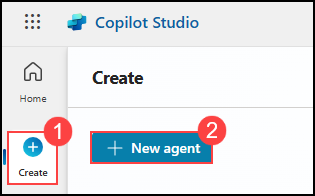

1. In the next pane, select **configure (1)** and provide the following details.

    | Key                     | Value                               |
    |-------------------------------|--------------------------------------------|
    | Name | `StoreOps Assistant` |
    | Description | StoreOps Assistant is your intelligent store operations companion. It helps staff quickly find products, understand store policies, place orders, and create support tickets—all through conversational AI. Integrated with Dataverse, Freshworks, and knowledge sources, this assistant streamlines everyday retail workflows with speed and accuracy. |
    | Instruction | You are an AI-powered assistant designed to support store operations staff. Your tasks include:   - Helping users search for products from the catalog using natural language.   - Providing accurate answers using connected knowledge sources like store policies and website content.   - Assisting in placing orders and logging them in Dataverse.   - Creating and tracking support tickets in Freshworks when issues arise.   Always respond in a clear, friendly, and professional tone. Use concise language and provide helpful follow-up suggestions when appropriate. If you’re unsure about a request, ask clarifying questions before proceeding. |

    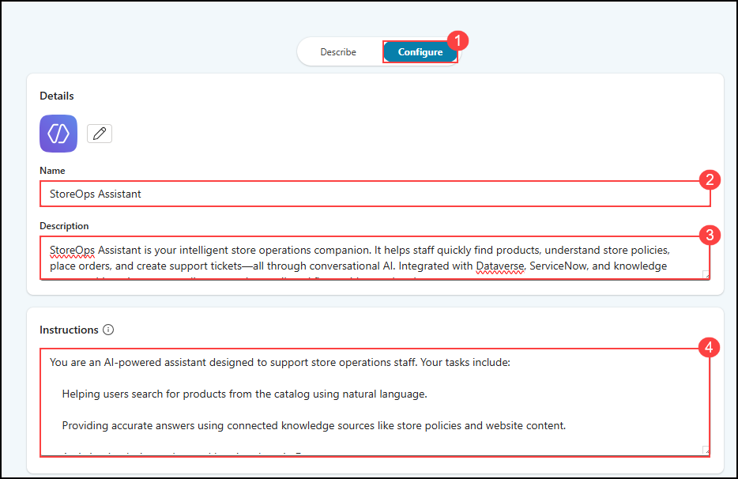

    >**Note:** Sometimes you may see a diffrent UI, if you are seeing a UI diffrent than this, then follow this below steps:

    - Click on **Skip to configure**, to get the configuration pane.

      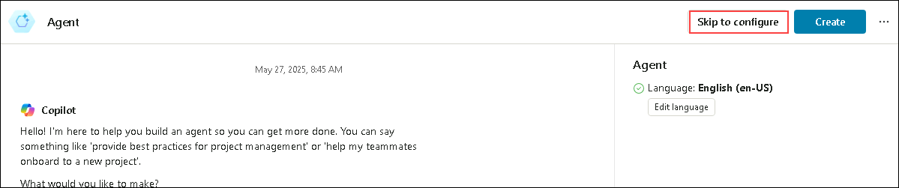
   
    - In the next pane, provide the same details given above and click on **Create**.

      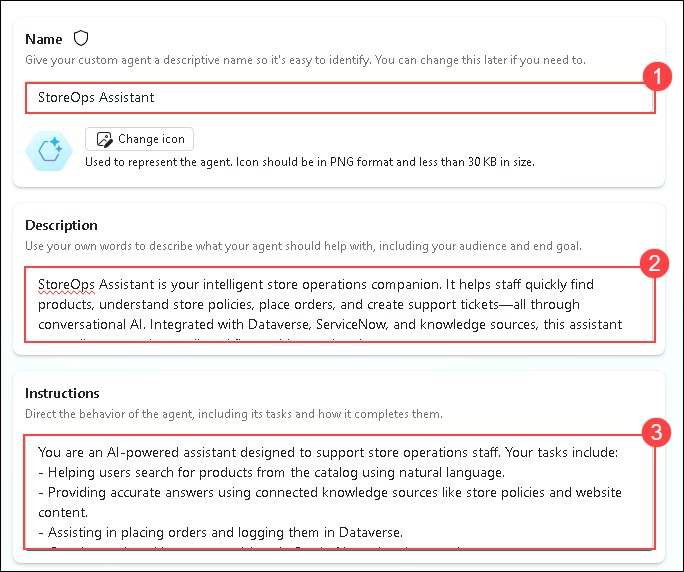

1. Once after adding the details, click on **Continue** to create the agent.

1. You have successfully created the StoreOps Assistant. In the next steps of this lab, you will enhance it further by adding knowledge sources and advanced features.

   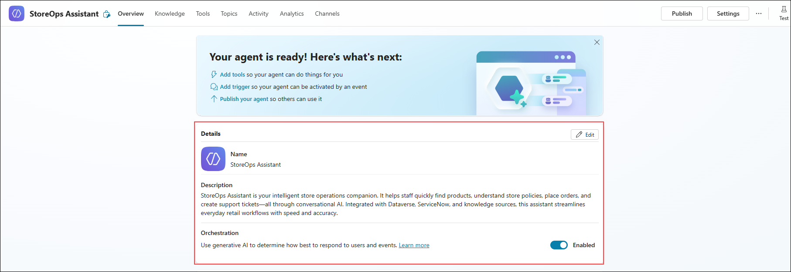

## Task 2: Adding knowledge sources to the agent

In this task, you will connect knowledge sources such as the product catalog, policy documents, and store website content to your agent, allowing it to provide AI-powered answers using Retrieval-Augmented Generation (RAG).

1. Navigate to Copilot Studio tab, and select **Knowledge (1)** tab from top menu and click on **+ Add knowledge (2)**.

   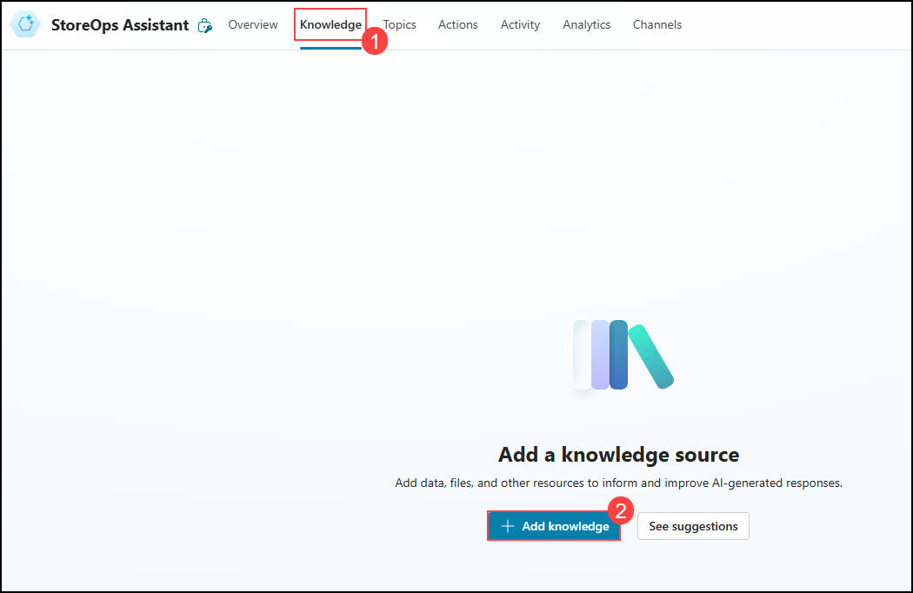

1. In the next pane, click on **select to browse** option as shown and in the pop up window to select files, navigate to `C:\datasets\Store-Operations-with-Copilot-Studio-lab-datasets\Fabrikam Returns Policy for Customers` file.

   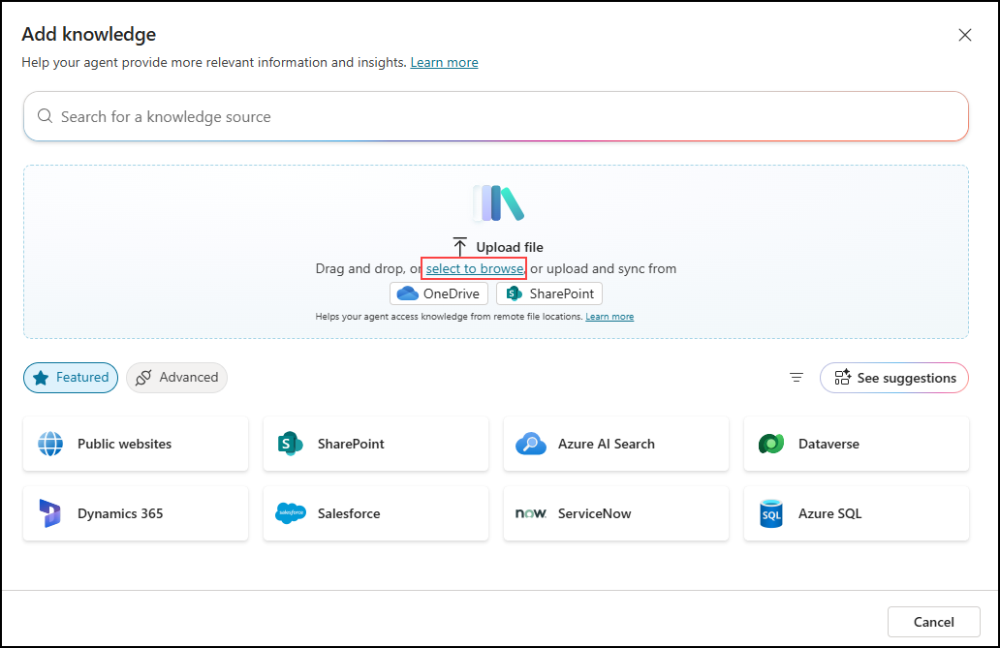

1. In the next pane, review that the **Fabrikam Returns Policy for Customers (1)** file is selected and click on **Add (2)**.

   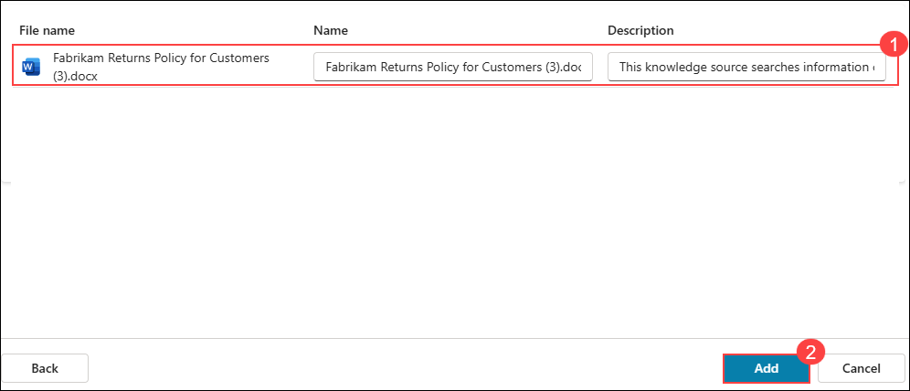

1. Once done, again click on **+ Add knowledge**.

   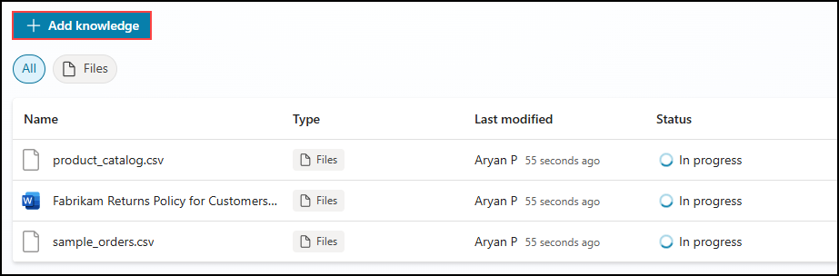

1. In the next pane, select **Dataverse** as knowledge source.

   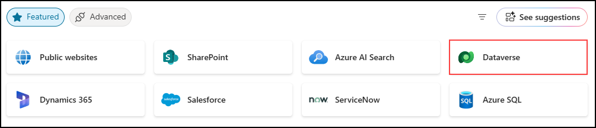

1. From the list, search and select **Order Record** and **Product** tables. Click on **Next**.

   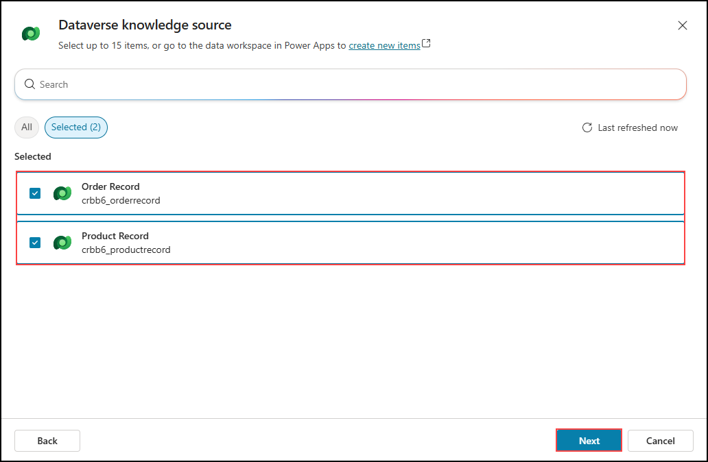

   >**Note:** If you are seeing **Product** table, instead of **Product Recrd**, please proceed with the **Product** Table.

1. Once done, again click on **+ Add knowledge**.

   

1. In the next pane, select **Public Websites** as knowledge source.

   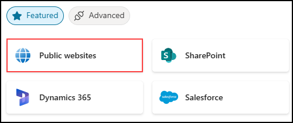

1. For **Public website link** add `https://prod.fabrikam.com` and click on **Add**.

   

   >Note: This is a sample E-Commerce website from Microsoft.

1. Once done, click on **Add** in the next pane.

   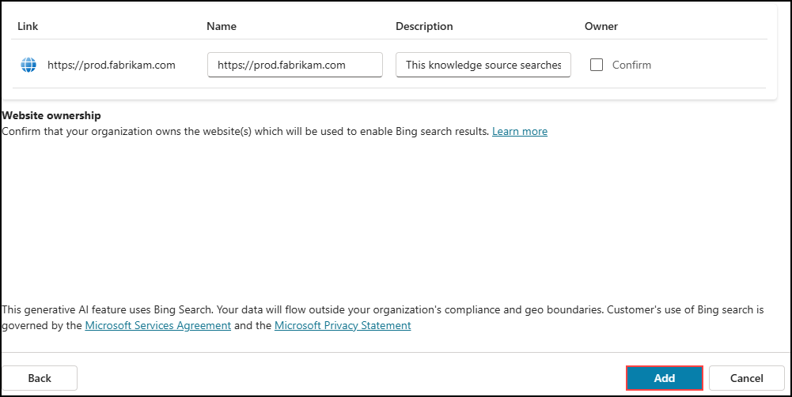

1. You have now successfully added all the necessary data as a knowledge source for this agent.

1. Select **Overview (1)** tab from top menu, scroll down to **Knowledge** and make **Allow the AI to use its own general knowledge** option as **Disabled (2)**.

   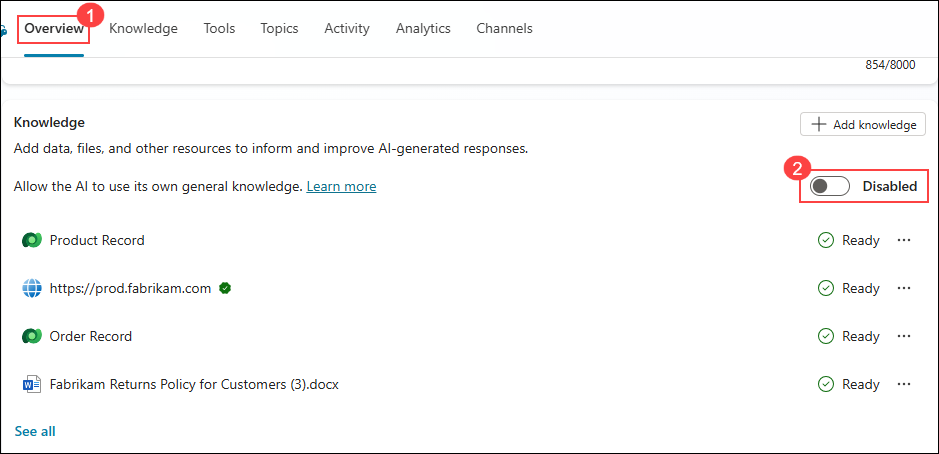

1. To test if the agent is ingested with knowledge or not, use the right message box to test the agent with some sample prompts given below:

   - `what all products are available in inventory?`
   - `What will the refund policy?`
   - `List out all the previous orders with the product name?`

     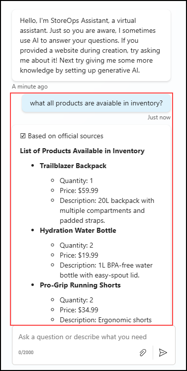

     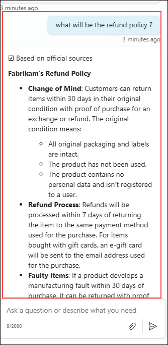

<validation step="a705bde5-f070-4276-959d-11df80a6d264" />
 
> **Congratulations** on completing the task! Now, it's time to validate it. Here are the steps:
> - Hit the Validate button for the corresponding task. If you receive a success message, you can proceed to the next task. 
> - If not, carefully read the error message and retry the step, following the instructions in the lab guide.
> - If you need any assistance, please contact us at cloudlabs-support@spektrasystems.com. We are available 24/7 to help.

## Summary

In this exercise, you created a Copilot Studio agent that served as the foundation for your store operations assistant. You defined the agent’s purpose by assigning it a name and description, and connected it to key knowledge sources such as the product catalog, store policy documents, and website content. These steps enabled the agent to deliver relevant, AI-powered responses based on indexed information.

### You have successfully completed this exercise, please continue to next one >>
