# Exercise 2: Create Store Operations Agent in Copilot Studio

### Estimated Duration: 45 Minutes

## Overview

In this exercise, you will create a Copilot Studio agent that will serve as the foundation for your store operations assistant. You will define the agent's purpose by assigning it a name and description, and connect it to knowledge sources such as the product catalog, store policy documents, and website content. These steps will allow your agent to return relevant responses based on indexed information.

## Objectives

You will be able to complete the following tasks:

- Task 1: Creating a store-operations agent in Copilot Studio

- Task 2: Adding knowledge sources to the agent

## Task 1: Creating a store-operations agent in Copilot Studio

In this task, you will create a new agent in Microsoft Copilot Studio by defining its name, description, and basic configuration settings. This agent will serve as the base for your store operations workflows.

1. In the Copilot Studio home page, from the left navigation pane, select **Agents (1)** and then select **Create blank agent (2)**.

   

1. In the **Name your agent** dialog, enter the following name in the **Name (1)** field and then select **Create (2)**.

   ```
   StoreOps Assistant
   ```

   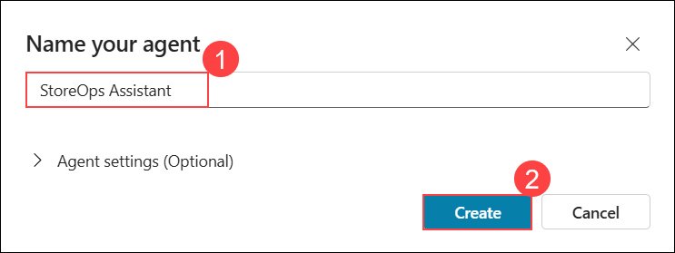

1. Wait until the **Getting things ready...** process completes and the agent is provisioned.

   

1. On the **Overview** page, select **Edit** to update the agent details.

   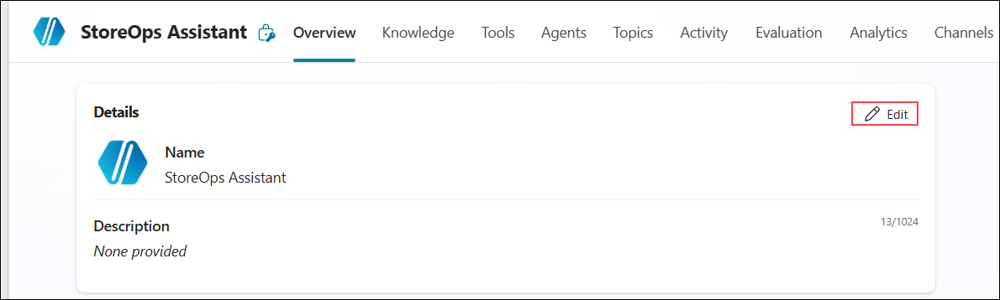

1. Enter the description in the **Description (1)** box, and then select **Save (2)** to apply the changes.

   ```
   StoreOps Assistant is your intelligent store operations companion. It helps staff quickly find products, understand store policies, place orders, and create support tickets, all through conversational AI. Integrated with Dataverse, SharePoint HelpDesk, and knowledge sources, this assistant streamlines everyday retail workflows with speed and accuracy.
   ```

   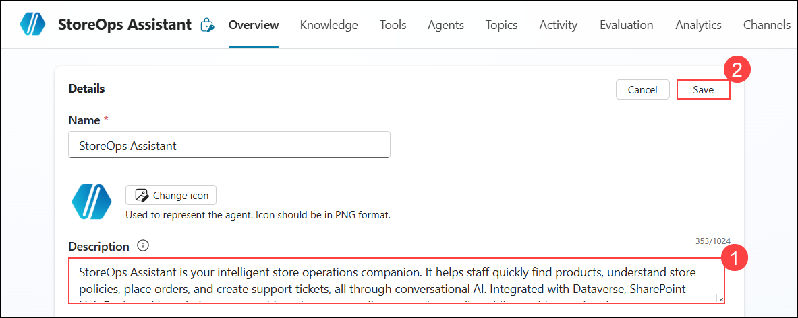

1. Select **Edit** to update the agent instructions.

   

1. Enter the agent instructions in the **Instructions (1)** box, and then select **Save (2)** to apply the changes.

   ```
   You are an AI-powered assistant designed to support store operations and staff. Help staff with:
   - Searching for products from the catalog using natural language
   - Providing accurate answers using connected knowledge sources such as store policies and website content
   - Assisting in placing orders and logging them in Dataverse
   - Creating and tracking support tickets in SharePoint HelpDesk when issues arise
   - Answering general store operations questions

   Always respond in a clear, friendly, and professional tone. Use concise language and provide helpful follow-up suggestions when appropriate. If a request is unclear, ask clarifying questions before proceeding.
   ```

   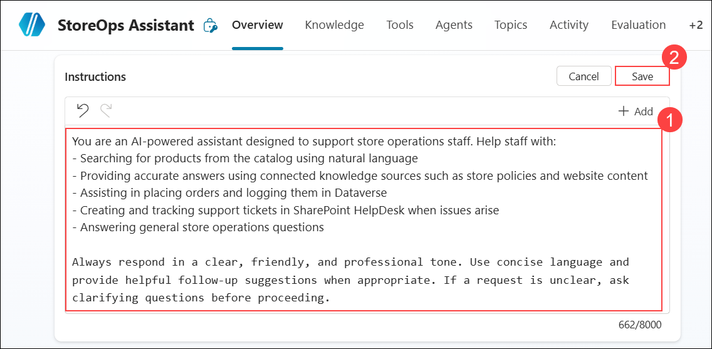

1. You have successfully created the StoreOps Assistant. In the next steps of this lab, you will enhance it further by adding knowledge sources and advanced features.

## Task 2: Adding knowledge sources to the agent

In this task, you will connect knowledge sources such as the product catalog, policy documents, and store website content to your agent, allowing it to provide answers using Retrieval-Augmented Generation (RAG).

1. Select **+ Add knowledge** to add data and resources to the agent.

   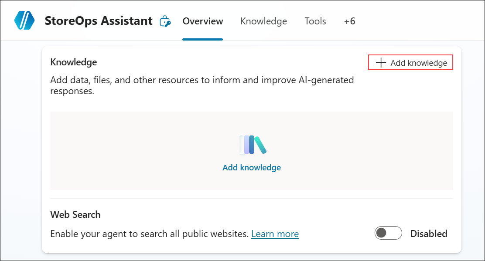

1. In the next pane, select **select to browse** and in the pop-up window to select files, navigate to `C:\datasets\Store-Operations-with-Copilot-Studio-lab-datasets\Fabrikam Returns Policy for Customers` file.

   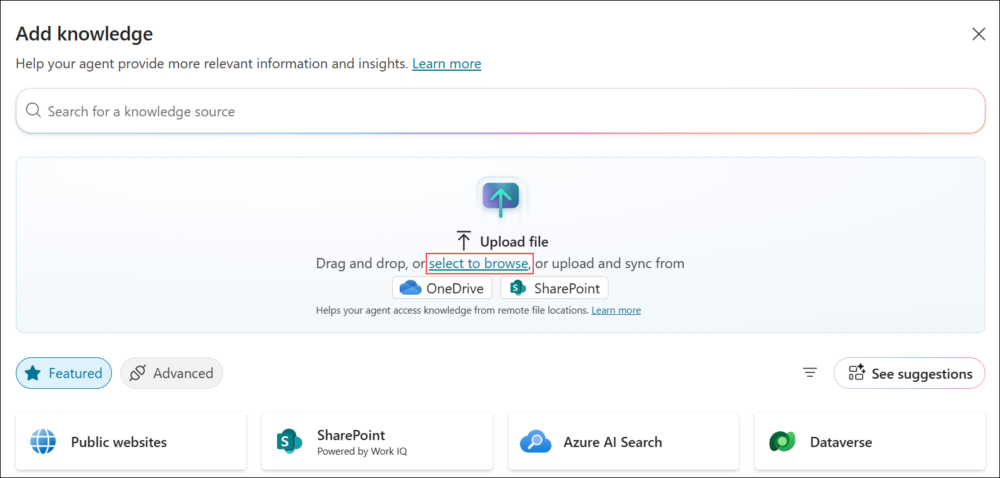

1. In the next pane, review that the **Fabrikam Returns Policy for Customers (1)** file is selected and select **Add to agent (2)**.

   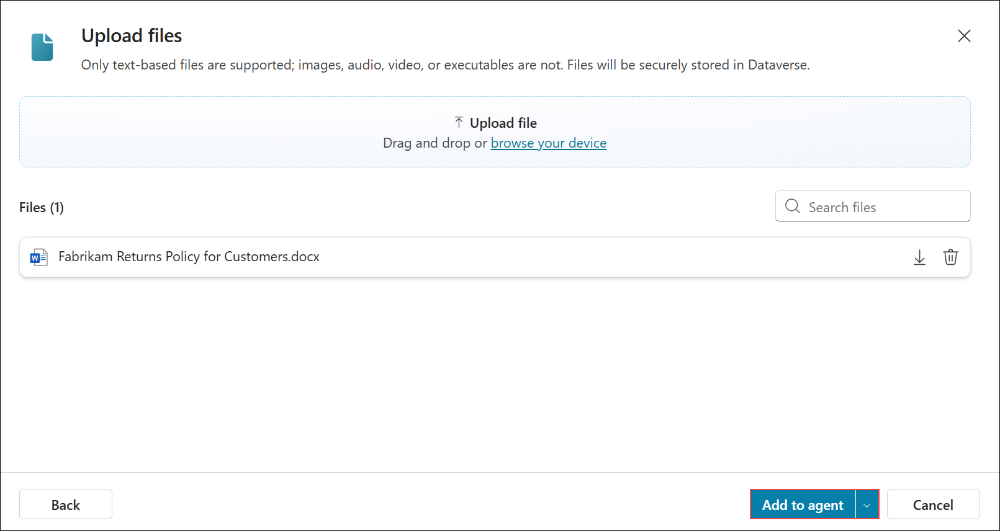

1. Once done, again select **+ Add knowledge**.

   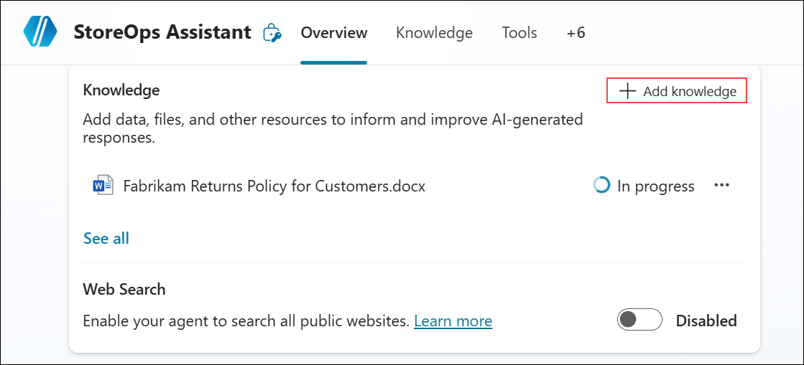

1. In the next pane, select **Dataverse** as the knowledge source.

   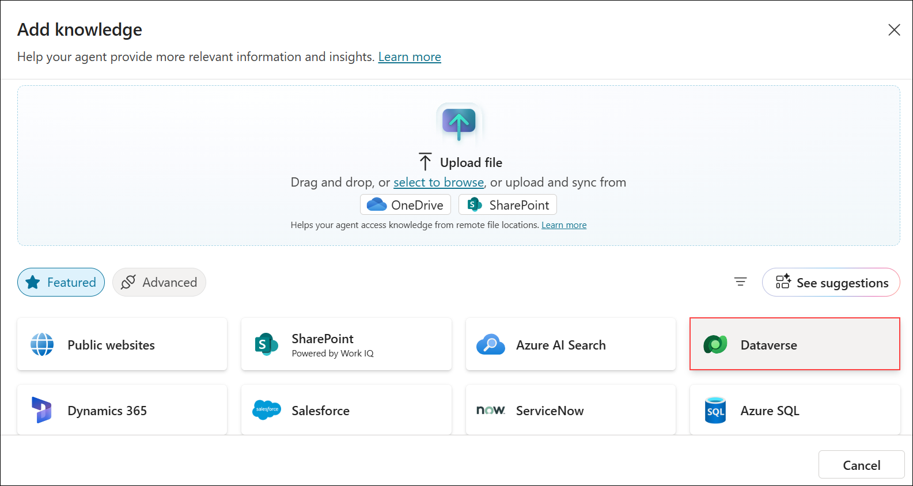

1. In the **Dataverse knowledge source** pane, search for **Order (1)** and select the **Order (2)** table.

   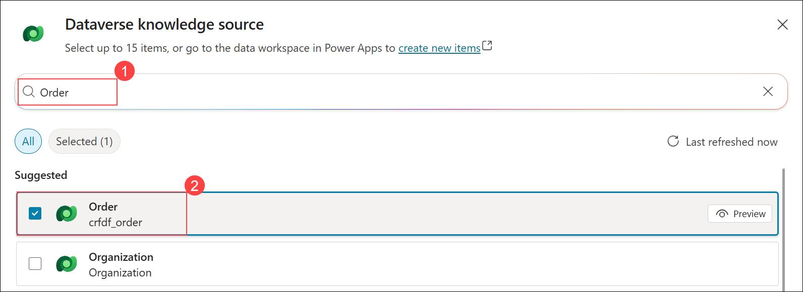

   >**Note:** If you are seeing **Order Record** table, instead of **Order**, please proceed with the **Order Record** Table.

1. In the **Dataverse knowledge source** pane, search for **Product (1)** and select the **Product (2)** table.

   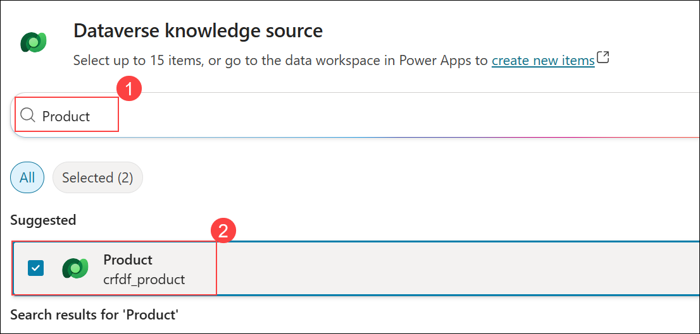

   >**Note:** If you are seeing **Product Record** table, instead of **Product**, please proceed with the **Product Record** table.

1. Clear the **Search (1)** field, select **Selected (2)** to review the chosen tables, and then select **Add to agent (3)**.

   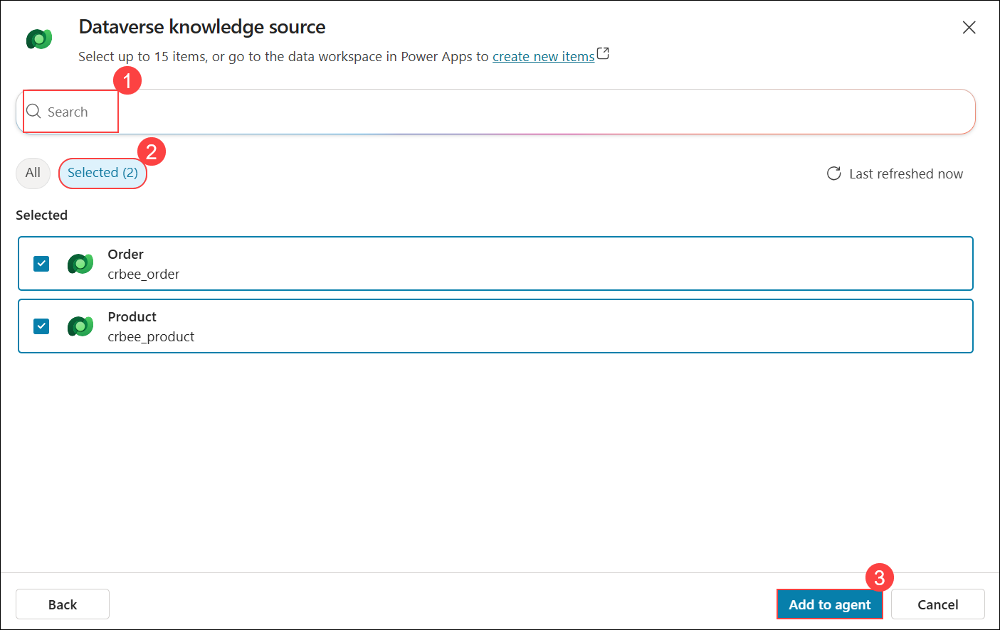

1. Once done, again select **+ Add knowledge**.

   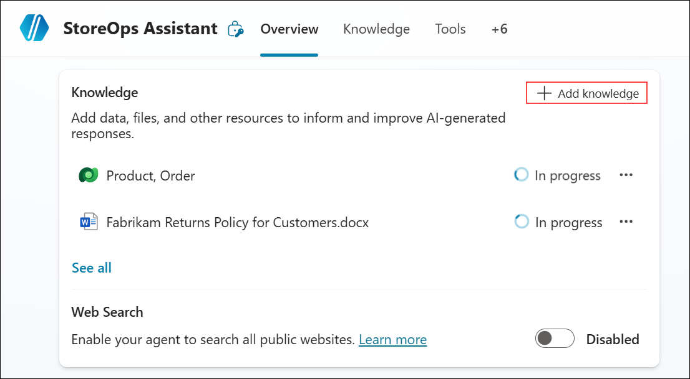

   > **Note:** If the **Product** or **Order** status appears as **Unknown**, do not worry. It may take **10–15 minutes** to change to **Ready**, and this will not affect the lab progress.

1. In the next pane, select **Public Websites** as the knowledge source.

   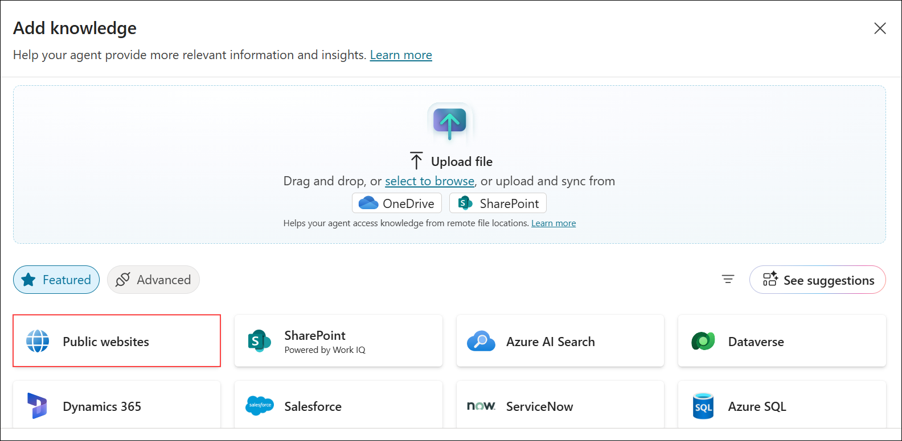

1. For **Public website link**, add the following URL **(1)** and select **Add (2)**.

   ```
   https://prod.fabrikam.com
   ```

   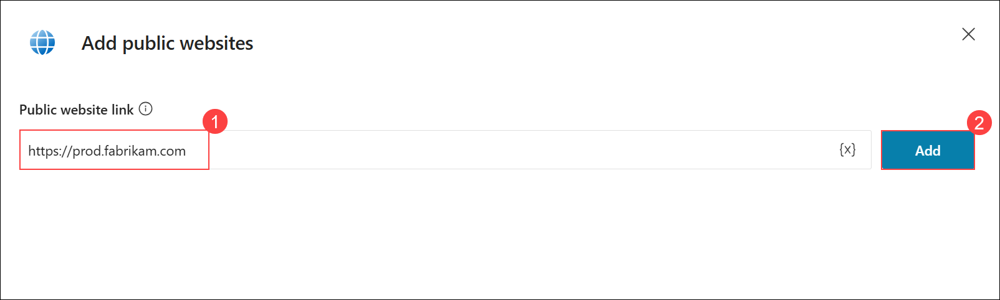

   >Note: This is a sample E-Commerce website from Microsoft.

1. Once done, select **Add to agent** in the next pane.

   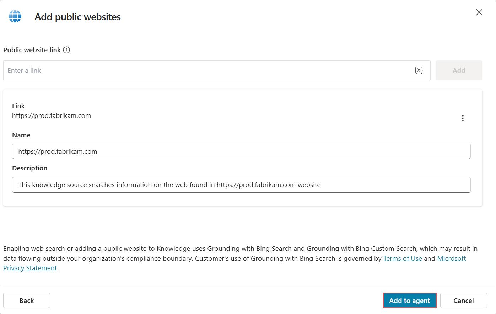

1. You have now successfully added all the necessary data as a knowledge source for this agent.

1. In the **Overview** tab, under **Web Search**, ensure the toggle is set to **Disabled**.

   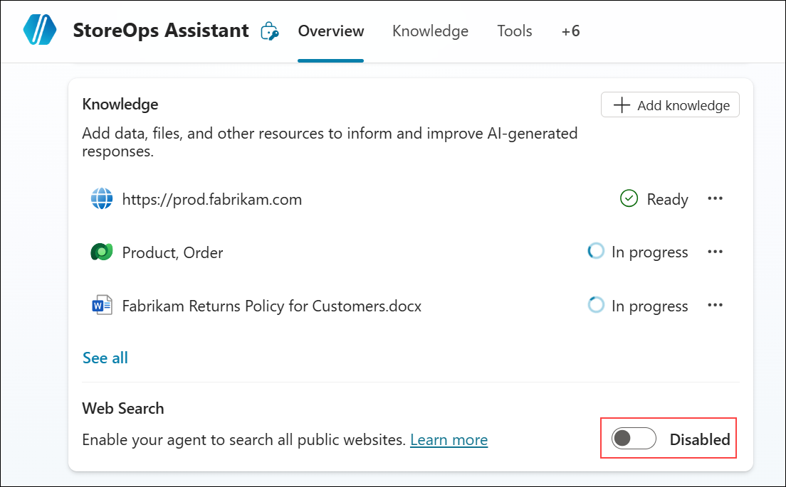

   > **Note:** If the **Product** or **Order** status appears as **Unknown**, do not worry. It may take **10–15 minutes** to change to **Ready**, and this will not affect the lab progress.

1. From the top-right corner, select **Test** to test the agent.

   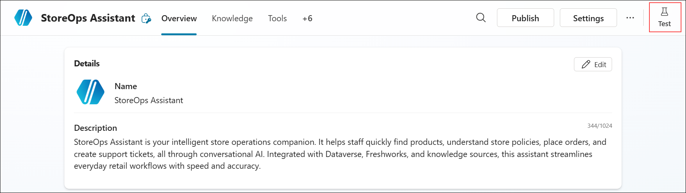

1. In the **Test your agent** pane, enter the following prompt in the message box **(1)** and select **Send (2)**.

   ```
   what all products are available in inventory?
   ```

   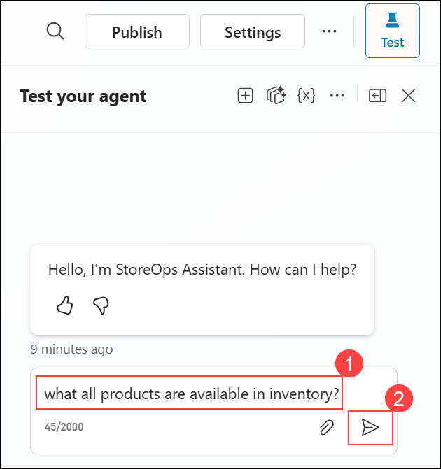

   > **Note:** The output format may vary based on the data and responses generated by the agent.

1. Verify that the agent searches through the connected knowledge sources such as **https://prod.fabrikam.com**, **Fabrikam Returns Policy for Customers.docx**, and **Product, Order**.

   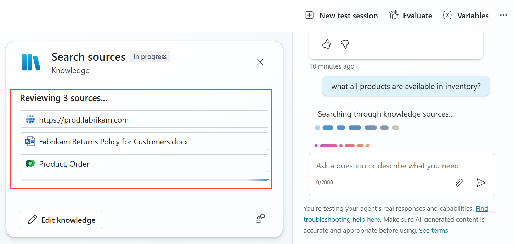

1. Review the response returned by the agent showing the **Available Products in Inventory**.

   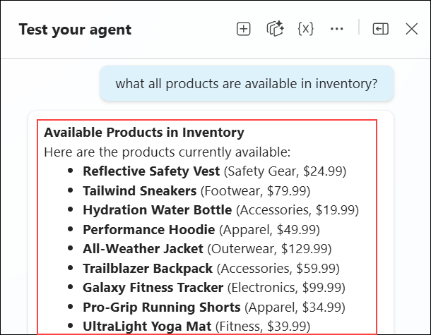

1. In the **Test your agent** pane, enter the following prompt in the message box **(1)** and select **Send (2)**.

   ```
   List out all the previous orders with the product name?
   ```

   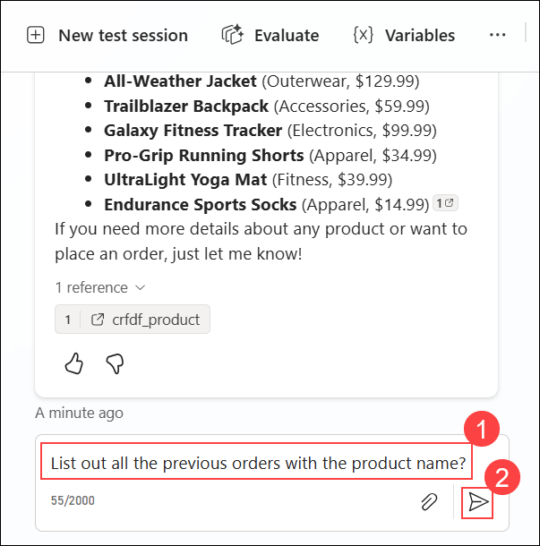

   > **Note:** The output format may vary based on the data and responses generated by the agent.

1. Verify that the agent returns the **Previous Orders with Product Names** using the connected knowledge sources.

   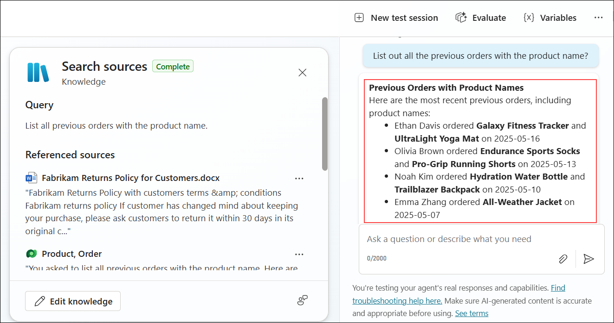

<validation step="a705bde5-f070-4276-959d-11df80a6d264" />
 
> **Congratulations** on completing the task! Now, it's time to validate it. Here are the steps:
> - Hit the Validate button for the corresponding task. If you receive a success message, you can proceed to the next task. 
> - If not, carefully read the error message and retry the step, following the instructions in the lab guide.
> - If you need any assistance, please contact us at cloudlabs-support@spektrasystems.com. We are available 24/7 to help.

## Summary

In this exercise, you created a Copilot Studio agent that serves as the foundation for your store operations assistant. You defined the agent's purpose by assigning it a name and description, and connected it to knowledge sources such as the product catalog, store policy documents, and website content. These steps allow the agent to return relevant responses based on indexed information.

### You have successfully completed this exercise, please continue to next one >>
