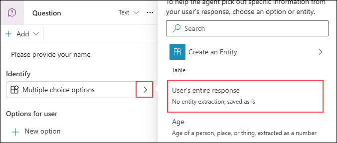
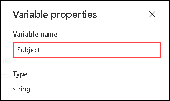
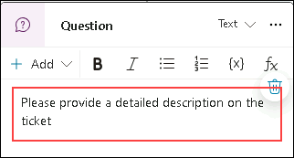
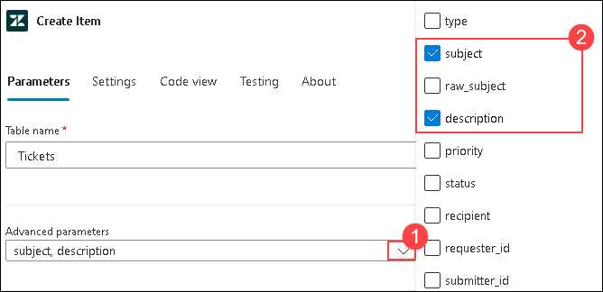
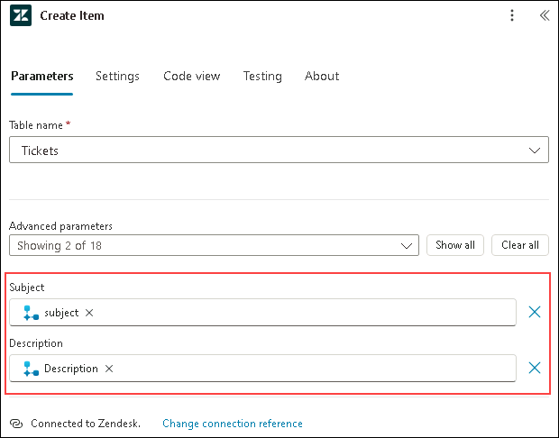

# Exercise 3: Build Advanced AI Workflows for Orders & Tickets

### Estimated Duration: 60 Minutes

## Overview

In this exercise, you will enhance your StoreOps Assistant by building advanced AI workflows that go beyond static knowledge responses. You will create dynamic topics that allow users to place orders and request support, while integrating your agent with external systems like Microsoft Dataverse and zendesk. These enhancements will enable your assistant to perform end-to-end operations such as order recording and automated ticket creation, making it more powerful and functional for real-world store operations.

## Objectives

You will be able to complete the following tasks:

- Task 1: Create a topic to record orders in Dataverse

- Task 2: Create a “Support Ticket” topic and integrate with zendesk

## Task 1: Create a topic to record orders in Dataverse

In this task, you will create a topic that allows users to place product orders using the StoreOps Assistant. The topic will collect essential details such as the product name, quantity, and delivery preferences. Once the user confirms the order, the assistant will trigger an action to store the order details in a Microsoft Dataverse table. This enables seamless tracking and management of customer orders within your store’s database.

1. In copilot Studio portal, select **Topics (1)** tab from top menu, click on **+ Add a topic (2)** and select **From blank**.

   

1. Once you are in the designer, on the **Trigger** node, add the description as `This topic helps user to place orders or buy products`.

   

1. Once done, click on **+ (1)** option to add a new node, from the list select **Ask a question** as the agent should ask a question to user related to the product they want to buy.

   
   
   >**Note:** In Microsoft Copilot Studio, the "Ask a question" node is used to collect specific information from the user during a conversation. It prompts the user with a question and captures their response, which is then stored in a variable for later use in the flow.

1. In the text area of the node, add the question as `Which product would you like to order?`.

   

1. Once done, change the identifier from **Multiple choice Options** to **User's entire response**. Click on **> (1)** as shown and select **User's entire response (2)**.

   

1. Now, click on **Var1** as we have to change the variable name.

   

1. Change the name to **ProductName** under Variable name.

   

1. Once done, again click on **+** to add a new node, select **Add a condition** as the next node.

   

1. For condition the agent will check the product that user shared is present in the list or catalogue or not, for now you will be adding a sample list directly as condition.

1. In the condition node, click on **>** to select the **ProductName** variable.

   

1. Once done, change the condition parameter using **V (1)** to **in (2)**.

   

1. In the value area, add the following list of products `Tailwind Sneakers, Performance Hoodie, All-Weather Jacket, Pro-Grip Running Shorts, Trailblazer Backpack, Hydration Water Bottle, Endurance Sports Socks, Reflective Safety Vest, Galaxy Fitness Tracker, UltraLight Yoga Mat`. The condition will check that, the product name provided by user is present here or not.

   

1. Now, you have to add fallback if the condition fails, click on **+** to add a node under **All other conditions** node and select **Send a message**.

   

1. In the text area, add the message as `The product is not avaiable, please look for other products we have!`.

   

1. Once done, add one more node below that, now from list, select **Topic management (1)** and click on **Go to step (2)**.

   

1. Once after selecting that option, you have to select a node, so that it will be navigated to that particular step directly.

1. Select the first **Question** node to select product as the Go to Step node.

   

1. Once done the flow look like this.

   

1. As the Other conditions are configured, now you have to continue building the flow further.

1. Now, under the condition node, add **Ask a question** node using **+** option as before.

   

1. In this node, add the question `Please specify the quantity you require` in the text area to get the quantity of the order.

   

1. Again change the identify to **Number**.

   

1. Now, click on **Var1** as we have to change the variable name.

   

1. Change the variable name to **Quantity**.

   

1. Once done, click on **+ (1)** option to add a new node, from the list select **Ask a question**.

   

1. In the question area, add the question as `Please provide your name`.

   

1. Change the indentify value to **User's entire response**.

   

1. Change the variable name to **UserName**.

   

1. Once done, click on **+ (1)** option to add a new node, from the list select **Ask a question**. 

   

1. In the question area, add the question as `Please provide your delivery address`.

   

1. Change the indentify value to **User's entire response**.

   

1. Change the variable name to **DeliveryAddress**.

   

1. Once done, please use the **Save** option from the top menu to save the flow.

   

1. In the pop up, under **Name your topic** provide name as `Place Orders` **(1)** and click on **Save (2)**.

   

1. Now that you have successfully created the flow to collect the order details, you need to create an Agent Flow (formerly known as Action) to add these order details to the Dataverse table.

## Task 2: Define an Agent Flow to Insert Order Details into Dataverse

In this task, you will create an action that inserts the collected order details—such as customer name, product name, and delivery address—into a Dataverse table. This Agent Flow will be triggered by the topic you created earlier and will handle the data insertion into the appropriate table within Microsoft Dataverse.

1. Once the flow is saved, click on **+** to add the new node under the previous node. Select **Add an action (1)** option from the list and click on **New Agent flow (2)** to create a new flow.

   

   >**Note:** You may see **Add a Tool** instead of **Add an Action**, please select **Add a Tool** option as they both work exactly same.

1. You will be navigated to a new designer experience, click on **When an agent calls the flow** node.

   

1. A new pane will be opened from the left, click on **Add an input** as we have to pass the user inputs such as `UserName`, `ProductName`, `DeliveryAddress` and `Quantity`.

   

   >**Note:** Here you will just be creating reference variables, as you will pass the actual variables further in this task.

1. Select **Text** as te datatype for the variable.

   

1. Provide **UserName** as the Input name.

   

1. Please repeat the same steps for `ProductName` and `DeliveryAddress`.

   

   

1. Again click on **Add an input** option, select **Number** as datatype for `Quantity`.

   

1. Provide **Quantity** as the Input name.

   

1. Once completed, the variables will look like this.

   

1. Now, click on **+** to add the **Dataverse** connector.

   

1. From the list, scroll down to **By connector** catagory and select **Microsft Dataverse**.

   

1. In the next pane to Add an action, select **Add a new row** option.

   

1. In the **Create connection** pane, click n **Sign in**.

   

1. Once done, a pop up window will be opened to pick an account for authentication. Select the user account which you are using for this lab.

   

   >**Note:** If you're unable to see a pop-up window or are encountering an error, it's likely that pop-ups are blocked in your browser. Please click the pop-up icon in your browser's address bar and allow pop-ups for this site.

   

1. Once done, in the next pane, click on **Allow access** Option to grant the agent access to update the Dataverse table.

   

1. In the configuration page, please select **Order Record** from the list under **Table name**.

   

1. For **OrderID**, you will add a function to generate globally unique ID to each orders. Click on **fx** option to add the function.

   

   >**Note:** If you are not able to see **OderID** parameter showing up by default, it means the parameter is not set as Primary index. You can select this parameter from advanced parameters below and configure it with **guid()** function.

1. In the text area, add `guid()` **(1)** - This will generate a Globally Unique Id. Click on **Add (2)**.

   

1. In the Advanced Parameters, click on **V** and select these parameters:

   - **CustomerName**
   - **DeliveryAddress**
   - **ProductName**
   - **Quantity**
   - **Status**

   

1. Once added, under **CustomerName** click on the shown symbol to add the **Dynamic content** as the value.

   

1. From the list values, select **UserName**.

   

1. Repeat the same steps for other parameters.

1. For **Status** parameter, select **Pending** as value from list.

   

1. Once after configuration, the parameters will look like this.

   

1. Now, you have successfully set up your agent flow, click on **Publish** from the top right corner to save the flow.

   

1. Once published, a pop up will be opened, click on **Go back to agent** to navigate back to your topic.

   

1. Once navigated to Actions, select **Topics (1)** from the top menu and click on **Place Order (2)** topic.

   

1. Once you are inside the topic, click on **+** and, click on **Add an action (1)** and select **Untitled (2)**.

   

   >**Note:** You may see **Add a Tool** instead of **Add an Action**, please select **Add a Tool** option as they both work exactly same.

1. In the **Action** node, under Username parameter click on **... (1)** and select **UserName (2)** variable.

   

1. Please repeat the same steps to add variables for all the Parameters.

1. Once done, the Action configuration will look like this.

   

1. Now, add a new node by clicking on **+** and select **Send a message** option from list.

   

1. In the text area, add the message as `Your order has been placed!`.

   

   >**Note:** This will be shown to the users, once the record is added to Dataverse table, you can be creative here by adding variable such as **UserName** and **ProductName** for a dynamic message.

1. Once done, please use the **Save** option from the top menu to save the flow.

   

1. Now use the **Test** area in the right to validate the working of the flow.

1. Provide the prompts as given below and check the flow of the agent:

   - ```
     I want to place an order
     ```

     
     
     >The agent will reply with a question to get the product details.

   - ```
     Galaxy Fitness Tracker
     ```
     

     >The agent will ask a question to get the quantity of the order.
   
   - ```
     1
     ```
     

     >The agent will ask to provide UserName

   - ```
     John
     ```
     

     >Next, the agent will ask for delivery address.

   - ```
     1st Street, California
     ```
     

     >Now the Action will run. It may take few seconds once done, you will get the acknowledgement.

     

1. Now, to verify the creation of record inside the dataverse table, navigate back to power apps portal.

1. once you are in Power apps portal, select **Tables (1)** from left menu and from the list click on **Order Record (2)** table.

   

1. Now, you can able to a record is added with the details that you have provided.

   

1. You have successfully created a flow with an Action to manage order placements.

## Task 2: Create a “Support Ticket” topic and integrate with zendesk

In this task, you will build a topic that enables users to request support by creating a service ticket. The topic will gather information like the issue description, urgency level, and user contact details. Once the data is collected, the agent will connect to zendesk and automatically generate a corresponding incident ticket. This integration ensures quick and efficient resolution of customer issues without manual ticket creation.

1. As you have started a free trial for zendesk. You will be creating a topic that integrating with zendesk.

1. In copilot Studio portal, select **Topics (1)** tab from top menu, click on **+ Add a topic (2)** and select **From blank**.

   

1. Once you are in the designer, on the **Trigger** node, add the description as `This topic helps user to create tickets and raise their queries`.

   

1. Once done, click on **+ (1)** option to add a new node, from the list select **Ask a question** as the agent should ask a question to user related to the product they want to buy.

   

1. In the text area of the node, add the question as `Kindly provide the subject for the ticket`.

   

1. Once done, change the identifier from **Multiple choice Options** to **User's entire response**. Click on **> (1)** as shown and select **User's entire response (2)**.

   

1. Now, click on **Var1** as we have to change the variable name.

   

1. Change the name to **Subject** under Variable name.

   

1. Once done, click on **+ (1)** option to add a new node, from the list select **Ask a question** as the agent should ask a question to user related to the product they want to buy.

   

1. In the text area of the node, add the question as `Please provide a detailed description on the ticket`.

   

1. Once done, change the identifier from **Multiple choice Options** to **User's entire response**. Click on **> (1)** as shown and select **User's entire response (2)**.

   

1. Now, click on **Var1** as we have to change the variable name.

   

1. Change the name to **Description** under Variable name.

   

1. Once done, please use the **Save** option from the top menu to save the flow.

   

1. In the pop up, under **Name your topic** provide name as `Ticket Creation` **(1)** and click on **Save (2)**.

   

1. Once the flow is saved, click on **+** to add the new node under the previous node. Select **Add an action (1)** option from the list and click on **New Agent flow (2)** to create a new flow.

   

1. You will be navigated to a new designer experience, click on **When an agent calls the flow** node.

   

1. A new pane will be opened from the left, click on **Add an input** as we have to pass the user inputs such as `Subject` and `Description`.

   

   >**Note:** Here you will just be creating reference variables, as you will pass the actual variables further in this task.

1. Select **Text** as te datatype for the variable.

   

1. Provide **Subject** as the Input name.

   

1. Repeat the same steps to add `Description` variable.

   

1. Now, click on **+** to add the **Dataverse** connector.

   

1. From the list, search for **Zendesk** and select **Create item**.

   

1. In the create connection pane, add the company name which is the first part of zendesk URL, which starts with contoso.

   

1. In the pop up window, provide these sign in credentials:

   - Email/Username: <inject key="AzureAdUserEmail"></inject>

   - Password: <inject key="AzureAdUserPassword"></inject>

   

1. In the next pane, Select **Allow**.

   

1. Once done, in the next pane, click on **Allow access** Option to grant the agent access to zendesk.

   

1. Once done, for **Table name**, from the list select **Tickets**.

   

1. For **Advanced parameters**, Click on **V (1)** and select **Subject** and **Description (2)**.

   


1. For **Subject** parameter, click on **Dynamic content Symbol** as shown.

   

1. From the variable list, select **Subject**.

   

1. For **Description** parameter, click on **Dynamic content Symbol** as shown and select **Description** from list.

   

1. Once configured, the connector will look like this.

   

1. Now, you have successfully set up your agent flow, click on **Publish** from the top right corner to save the flow.

   

1. Once published, a pop up will be opened, click on **Go back to agent** to navigate back to your topic.

   

1. Now, you can see an action will be populated in your topic.

   

1. In **Action** node, click **>** under description and select **Description**.

   

1. Please repeat the same steps to configure the variable for **Subject** parameter.

1. Once done, the action will look similar to this.

   

1. Now, add a new node by clicking on **+** and select **Send a message** option from list.

   

1. In the text area, add the message as `Thank you, your ticket has been successfully submitted`.

   

1. Once done, please use the **Save** option from the top menu to save the flow.

   

1. Now use the **Test** area in the right to validate the working of the flow.

1. In the chat area, add prompt as `I want to create a ticket` and send it.

   

1. Now, the agent will ask a question get subject for ticket. Add the subject as `Refund Not Received`.

   

1. Again the agent will ask a question to get a description on the ticket. Provide the below description:

   ```
   I returned an order and requested for a refund . However, I have not yet received the refunded amount.
   The expected refund timeline has passed, and I would appreciate it if you could look into this matter. Please let me know if any additional information is required from my side.
   ```

   

1. You will now see a confirmation from the agent indicating that the ticket has been successfully created.

   

1. Navigate back to **Zendesk** portal, you can see that the ticket with a subject **Refund Not Received** is created.

   

## Summary

In this exercise, you enhanced your StoreOps Assistant by building advanced AI workflows that extended beyond static knowledge responses. You created dynamic topics that allowed users to place orders and request support, while integrating your agent with external systems like Microsoft Dataverse and zendesk. These enhancements enabled your assistant to perform end-to-end operations such as order recording and automated ticket creation, making it more powerful and functional for real-world store operations.

### You have successfully completed this exercise, please continue to next one >>