# Exercise 4: Deploy & Publish Your Agent to Microsoft Teams

### Estimated Duration: 30 Minutes

## Overview

In this exercise, you will deploy your completed StoreOps Assistant to Microsoft Teams. This step allows users to interact with the assistant directly within a Teams channel, making it easily accessible for daily operations. You will also validate its end-to-end functionality by testing core features such as product lookup, order placement, and support ticket creation within the Teams environment.

## Objectives

You will be able to complete the following tasks:

- Task 1: Publish the agent to a Microsoft Teams channel

## Task 1: Publish the agent to a Microsoft Teams channel

In this task, you will configure and publish your StoreOps Assistant to Microsoft Teams. You will complete the necessary steps to make the agent available within a Teams channel, ensuring that team members can access and use it as part of their daily workflow.

1. Now that you've configured the agent, it's time to publish it so it can be used across different platforms.

1. From the top menu, click on **Channels (2)** option, if you can't see it directly click on **+1 (1)** so that you can see it.

   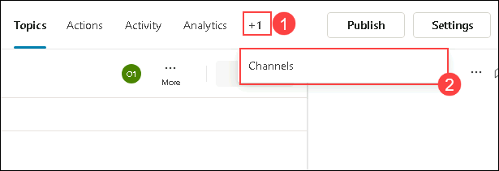

1. From the list of channels, select **Teams and Microsoft 365 Copilot**. Configuring this channel will publish the agent to both Teams and Microsoft 365 Copilot.

   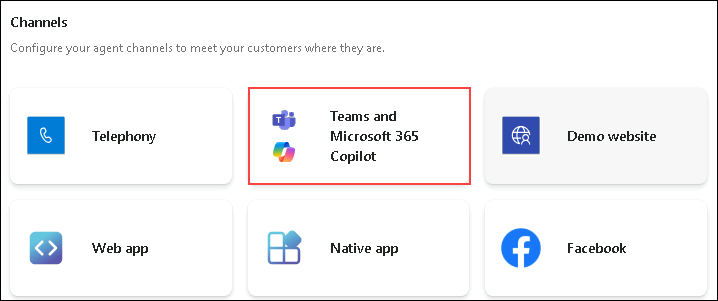

1. In the next pane, click on **Add channel**.

   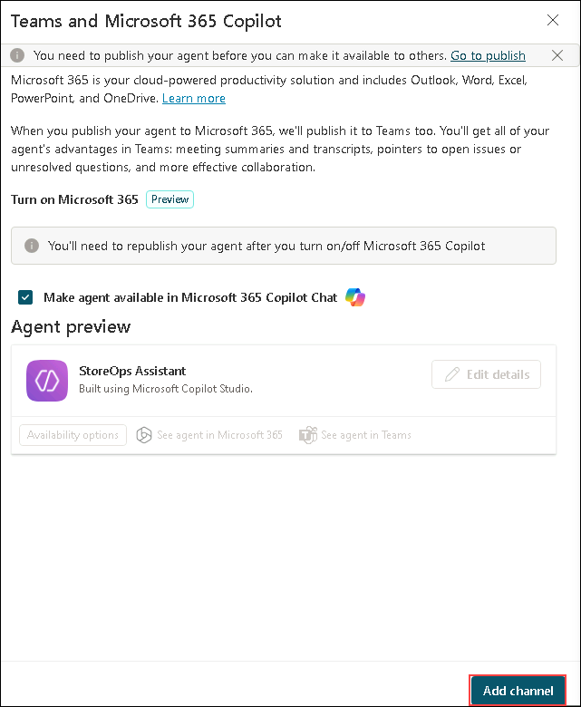

1. Click on **Publish** in the pop up window to publlish your agent to the selected channel.

   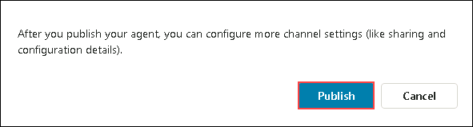

1. Once published, in the same pane, click on **See agent in Teams**.

   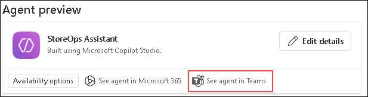

1. Now, you will be navigated to a new browser tab, Click on **Use the web app instead**.

   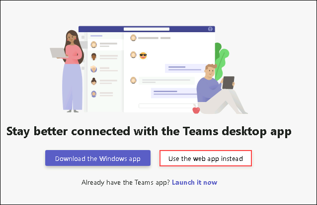

1. Once you are in Teams web app, click on add to add the agent to the chat.

   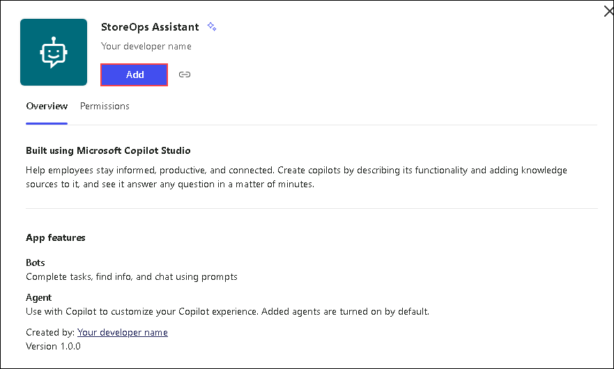

1. In the next pane, Click on **Open** to open the **StoreOps Assistant** in Teams.

   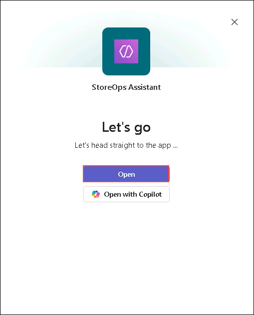

1. Now the **StoreOps Assistant** will be opened in teams, you can tryout some prompts for `Placing Orders`, `Creating Tickets` and validate it.

   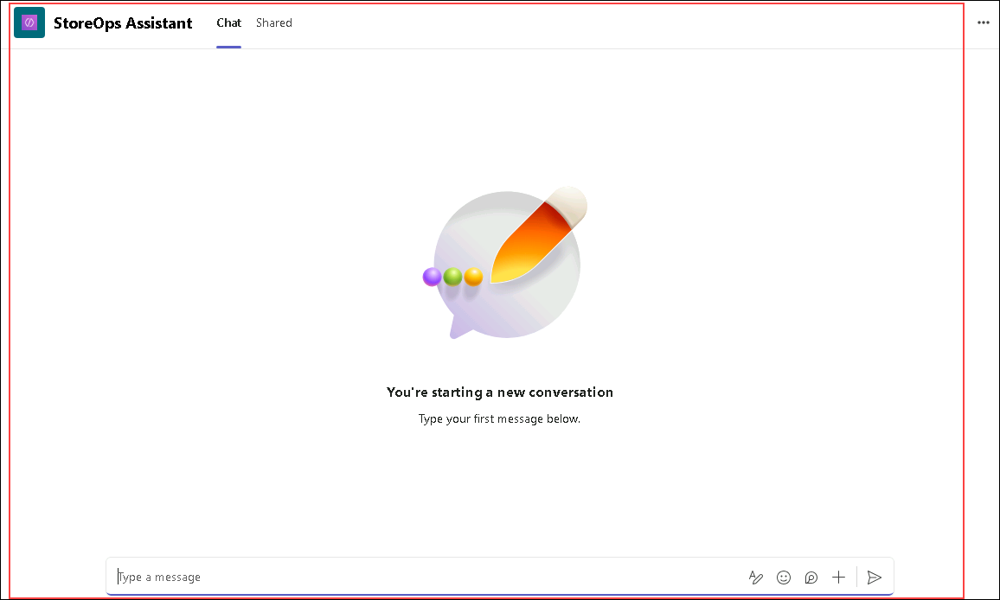

1. Once done, navigate back to Copilot Studio and select **See agent in Microsoft 365**.

   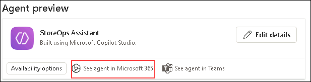

1. In the next pane, Click on **Add** to add the StoreOps Assistant to Microsoft 365 copilot.

   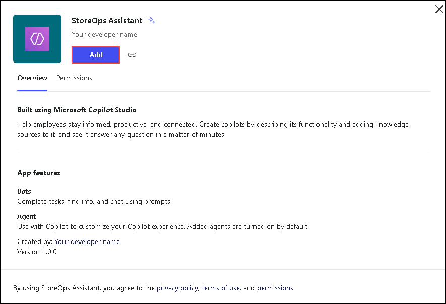

   >**Note:** If you are not navigated to copilot chat, please wait for sometime and publish the agent again from copilot studio and try accessing it again.

1. Once added, you will be navigated to **Copilot Chat** pane, where the **StoreOps Assistant** is opened. You can tryout some prompts for `Placing Orders`, `Creating Tickets` and validate it.

   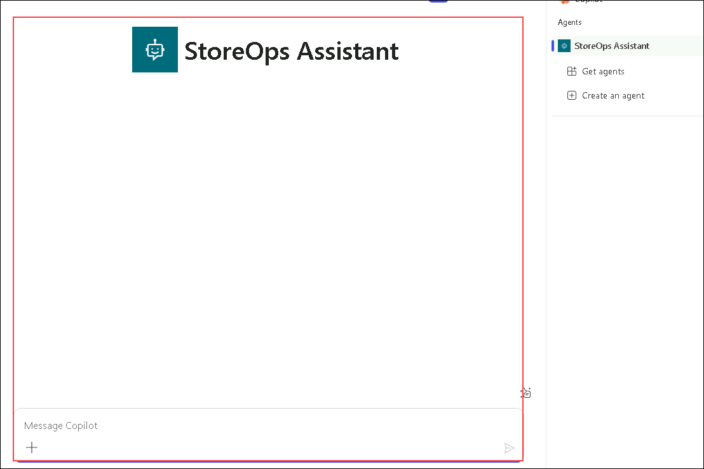

## Summary

In this exercise, you deployed your completed StoreOps Assistant to Microsoft Teams. This step enabled users to interact with the assistant directly within a Teams channel, making it easily accessible for daily operations. You also validated its end-to-end functionality by testing core features such as product lookup, order placement, and support ticket creation within the Teams environment.

### You have successfully completed the Lab!