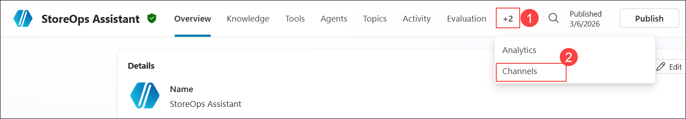
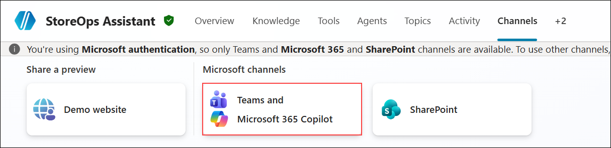
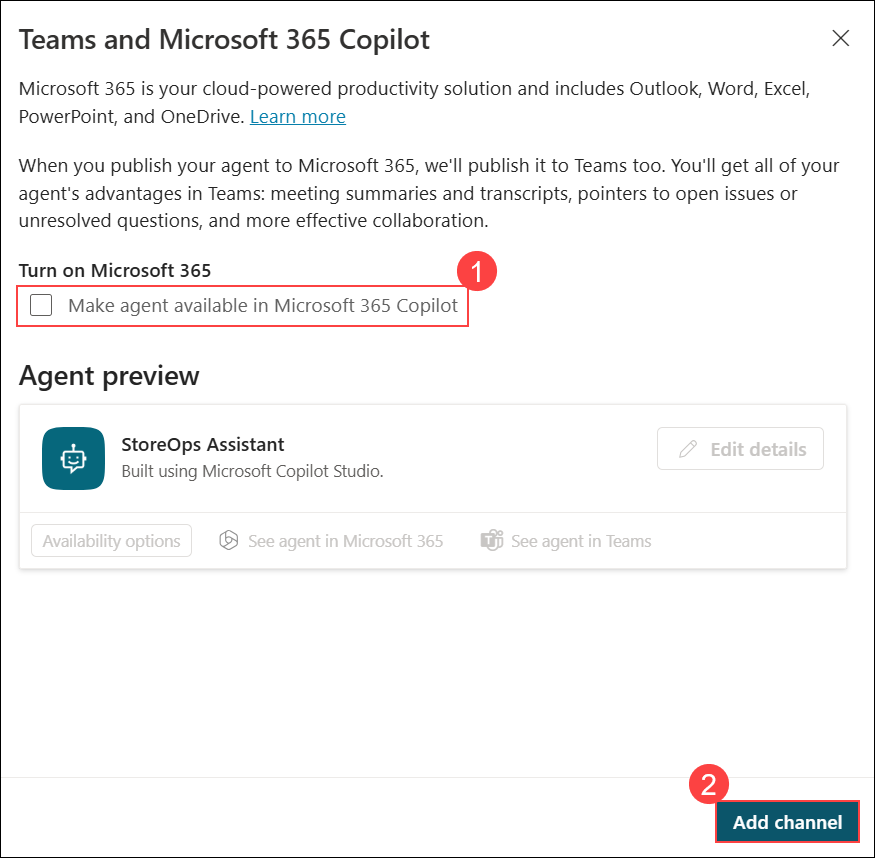
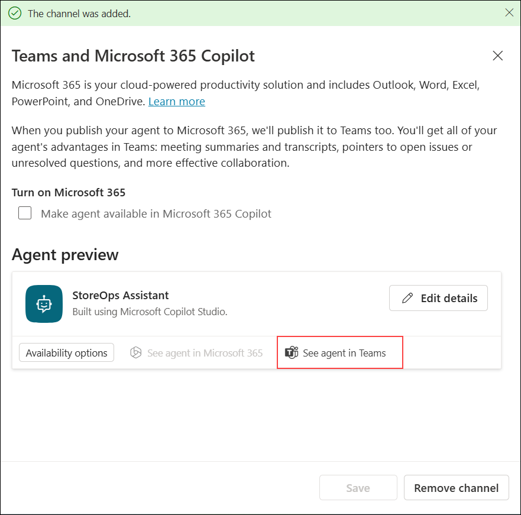
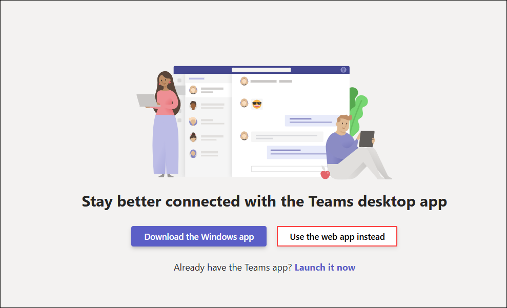
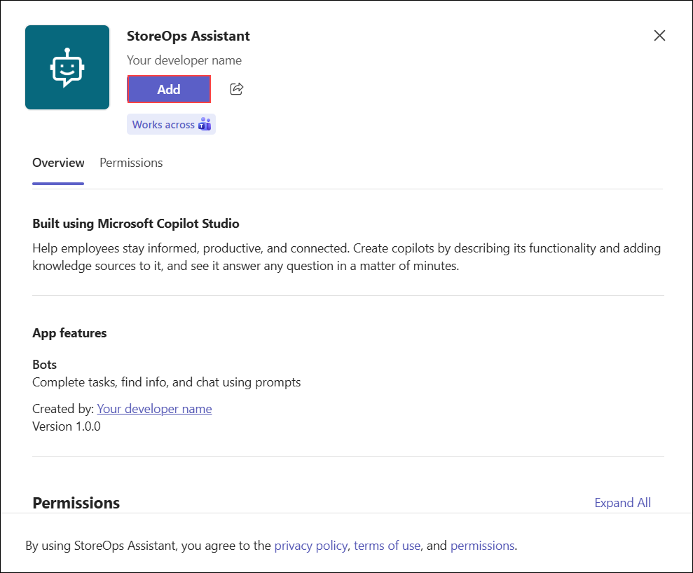
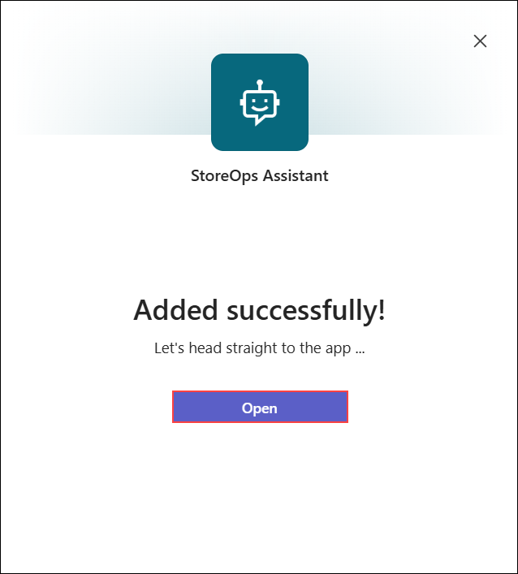
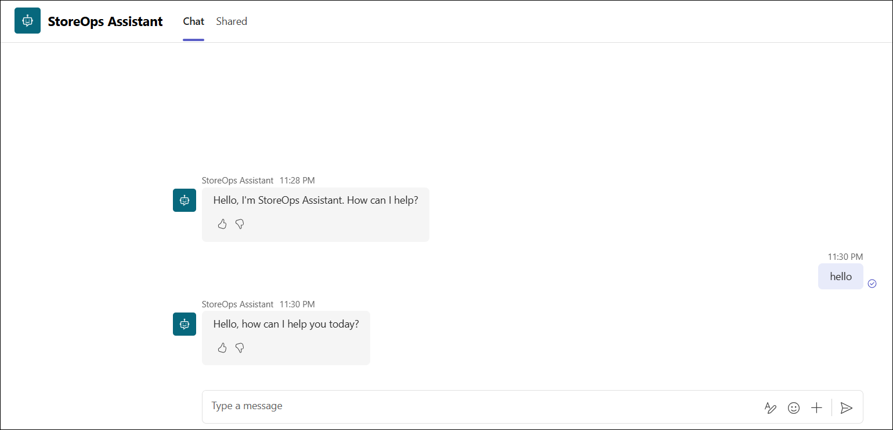

# Exercise 4: Deploy & Publish Your Agent to Microsoft Teams

### Estimated Duration: 30 Minutes

## Overview

In this exercise, you will deploy your completed StoreOps Assistant to Microsoft Teams. This step allows users to interact with the assistant directly within a Teams channel, making it easily accessible for daily operations. You will also validate its end-to-end functionality by testing core features such as product lookup, order placement, and support ticket creation within the Teams environment.

## Objectives

You will be able to complete the following tasks:

- Task 1: Publish the agent to a Microsoft Teams channel

## Task 1: Publish the agent to a Microsoft Teams channel

In this task, you will configure and publish your StoreOps Assistant to Microsoft Teams. You will complete the necessary steps to make the agent available within a Teams channel, ensuring that team members can access and use it as part of their daily workflow.

1. Now that you've configured the agent, it's time to publish it so it can be used across different platforms.

1. From the top menu, select **Channels (2)**. If you can't see it directly, select **+1 (1)** to expand the menu.

   

1. From the list of channels, select **Teams and Microsoft 365 Copilot**. Configuring this channel will publish the agent to both Teams and Microsoft 365 Copilot.

   

1. On the **Teams and Microsoft 365 Copilot** dialog box, ensure you uncheck the box for **Make agent available in Microsoft 365 Copilot (1)** and then select **Add channel (2)**.

   

1. Once the channel has been successfully added, select **See agent in Teams** to view and interact with your agent directly within Microsoft Teams.

   

1. You will be navigated to a new browser tab. Select **Use the web app instead**.

   

1. Once you are in the Teams web app, select **Add** to add the agent to the chat.

   

   > **Note:** In case you do not see the **Add** option, please retry the process starting from **Step 5**.

1. In the next pane, select **Open** to open the **StoreOps Assistant** in Teams.

   

1. The **StoreOps Assistant** will open in Teams. You can try out some prompts for `Placing Orders`, `Creating Tickets` and validate it.

   

## Summary

In this exercise, you deployed your completed StoreOps Assistant to Microsoft Teams. This step enabled users to interact with the assistant directly within a Teams channel, making it easily accessible for daily operations. You also validated its end-to-end functionality by testing core features such as product lookup, order placement, and support ticket creation within the Teams environment.

### You have successfully completed the Lab!