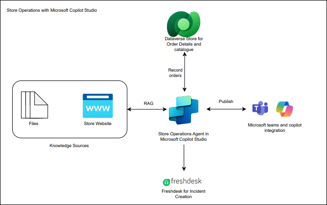
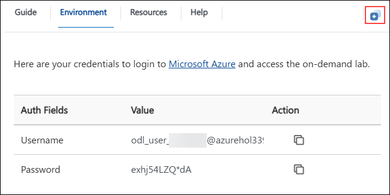
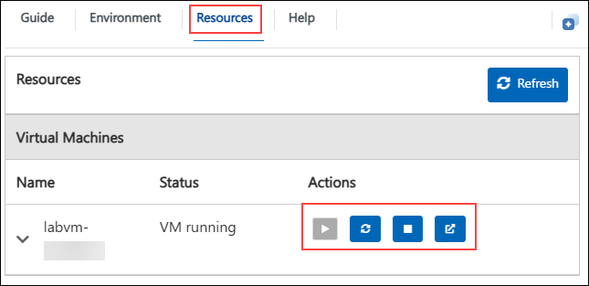
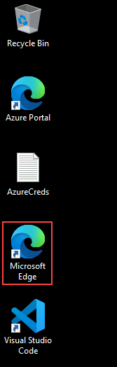
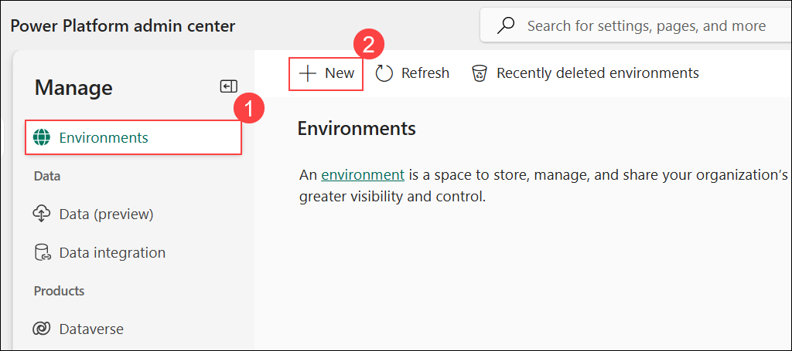
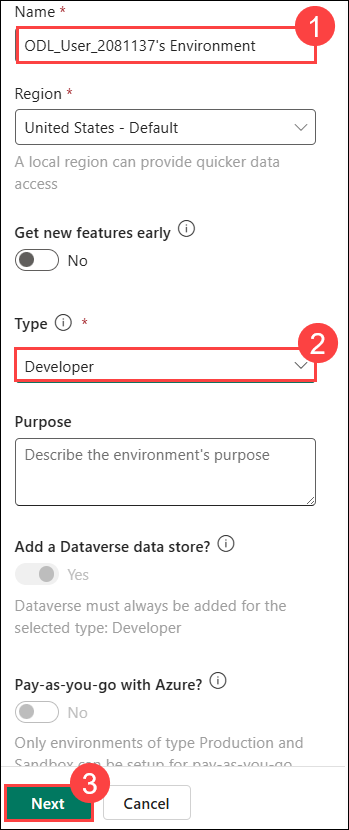
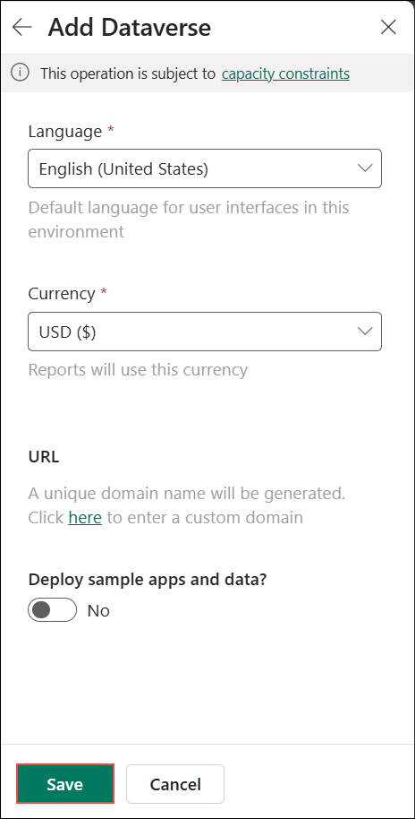
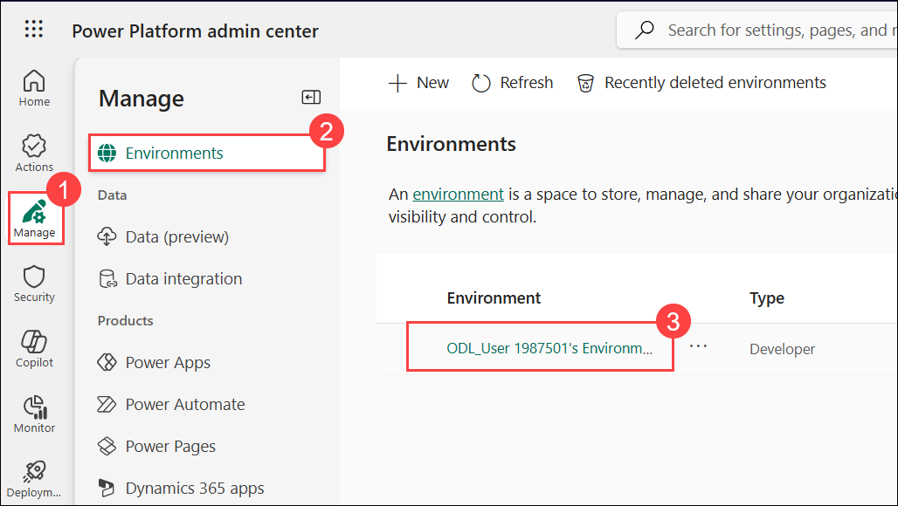
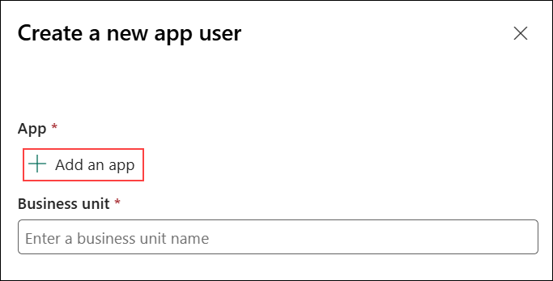

# Store Operations with Microsoft Copilot Studio

### Overall Estimated Duration : 3 Hours

## Overview

This hands‑on lab guides participants through building and automating a smart store‑operations agent using Microsoft Copilot Studio. Participants will explore ingesting and indexing product catalogs, policy documents, website content and servicedesk data. The lab covers customizing knowledge topics and automating workflows for product search, order placement, Dataverse logging, and Freshworks ticket creation. Additionally, participants will learn to publish their finished agent to custom channels such as Microsoft Teams or a web portal.

## Objective

Learn to build and automate a smart store‑operations agent using Microsoft Copilot Studio, leveraging AI models like text embeddings, language models, and generative AI. By the end of this lab, you will:

- **Setting up Pre-Requisites for Store operations Agent:** Understand how to set up your Power Platform tenant, enable the Copilot Studio free trial, and configure Azure AI and Dataverse permissions.

- **Create Store‑Operations Agent in Copilot Studio:** Get insights on spinning up a new Copilot Studio agent, assigning it a name and description, and connecting initial knowledge sources (product catalog, policy docs, website content).

- **Build Advanced AI Workflows for Orders & Tickets:** Understand how to extend your agent with retrieval‑augmented prompts, configure actions to record orders in Dataverse, and integrate Freshworks to auto‑create support tickets.

- **Deploy & Publish Your Agent to Microsoft Teams:** Get insights on packaging and publishing your completed agent into a Teams channel, then validating end‑to‑end functionality—product lookup, order placement, and ticket creation—directly within Teams.

## Pre-requisites

Participants should have the following prerequisites:

- **Familiarity with Azure Resources:** Basic understanding of Azure services and the Azure portal for managing cloud resources.

- **Knowledge of Copilot Studio:** Familiarity with Copilot Studio and its capabilities for building AI-driven solutions.

## Architecture

The architecture enables end‑to‑end store operations automation by seamlessly ingesting, processing, indexing, and interacting with multiple data sources in Copilot Studio. Product catalogs, policy documents, and website content are ingested as knowledge sources. Workflow actions—such as placing orders in Dataverse and opening tickets in Freshworks—are wired into the agent via Copilot Studio’s action framework. Finally, the fully indexed, action‑enabled agent is published into a Microsoft Teams channel, delivering intuitive, conversational store‑operations support directly where your staff already collaborate.

## Architecture Diagram



## Explanation of Components

The architecture for this lab involves several key components:

- **Copilot Studio:** Facilitates user interaction by connecting to Azure AI Search for Q&A and other workflows. It provides an intuitive interface for leveraging indexed data and AI capabilities in real-time.

- **Freshworks:** Manages support and exception workflows by exposing ticket‑creation and incident‑management APIs. The Copilot Studio agent invokes Freshworks actions to automatically open, update, and track service tickets based on user requests or operational alerts.

- **Dataverse:** Acts as the centralized, low‑code data backend for transactional records. It stores order entries, inventory updates, and other structured data; the Copilot Studio agent uses Dataverse actions to create, read, update, and delete records as part of automated store‑operations workflows.

## Getting Started with Lab

Welcome to Store Operations with Microsoft Copilot Studio Hands-On-Lab! We've prepared a seamless environment for you to explore and learn. Let's begin by making the most of this experience.

### Accessing Your Lab Environment

Once you're ready to dive in, your virtual machine and Lab guide will be right at your fingertips within your web browser.


### Exploring Your Lab Resources

To get a better understanding of your Lab resources and credentials, navigate to the Environment tab.


### Utilizing the Split Window Feature

For convenience, you can open the Lab guide in a separate window by selecting the **Split Window** button from the top-right corner.



### Managing Your Virtual Machine

Feel free to start, stop, or restart your virtual machine as needed from the Resources tab. Your experience is in your hands!



## Let's Get Started with Power Apps Portal

1. In the JumpVM, select the **Microsoft Edge** browser shortcut on the desktop.

   

1. Open a new browser tab and navigate to the Power Apps portal by entering the following URL:

   ```
   https://make.powerapps.com/
   ```

1. On the **Sign into Microsoft** tab, enter the following email **(1)** in the email field, and then select **Next (2)** to proceed.

   - Email: **<inject key="AzureAdUserEmail"></inject>**

     

1. On the **Enter Temporary Access Pass** screen, enter the following **Temporary Access Pass**, and then select **Sign in (2)**.

   - Temporary Access Pass: **<inject key="AzureAdUserPassword"></inject>**

     
     
1. If you see the pop-up **Stay Signed in?**, select **No**.

   

1. If the **Welcome to Power Apps** pop-up appears, leave the default country/region selection and select **Get started**.

   

1. You have now successfully logged in to the Power Apps portal. Keep the portal open.

   

   > **Note:** We are signing in to the Power Apps portal because it automatically assigns a Developer license, which is required to create and use a Developer environment in the next steps.

1. Open a new browser tab and navigate to the Power Platform admin center by entering the following URL:

   ```
   https://admin.powerplatform.microsoft.com
   ```

1. In the **Power Platform admin center**, select **Manage** from the left navigation pane.

   

1. In the Power Platform admin center, select **Environments (1)** from the left navigation pane, and then select **New (2)** to create a new environment.

   

1. In the **New environment** pane, configure the environment with the following settings, and then select **Next (3)**:

   - Enter **ODL_User <inject key="DeploymentID" enableCopy="false"></inject>'s Environment** in the **Name (1)** field.
   - Select **Developer (2)** from the **Type** dropdown.

      

1. In the **Add Dataverse** pane, leave all settings as default, and then select **Save**.

   

   > **Environment foundation:** This step creates the foundational environment that will support your agents with company-specific data and knowledge sources.

   > **Note:** Environment provisioning may take 10-15 minutes to complete. Wait until the status shows as ready before proceeding.

   > **Note:** If you see an error stating that the environment list cannot be displayed, this is expected while the environment is being created in the background. After 10-15 minutes, refresh the browser and the environment should appear.

1. In the **Power Platform admin center**, select **Manage (1)**, choose **Environments (2)**, and then select **ODL_User <inject key="DeploymentID" enableCopy="false"/>'s Environment (3)**.

   

1. On the environment page, select **See all** under **S2S apps**.

   

1. In the next pane, select **+ New app user**.

   

1. In the **Create a new app user** pane, under **App**, select **+ Add an app**.

   

1. In the **Add an app from Microsoft Entra ID** pane, enter the URL provided below in the search box **(1)**, select the app from the results **(2)**, and then select **Add (3)**.

   ```
   https://cloudlabssandbox.onmicrosoft.com/cloudlabs.ai/
   ```

   

1. Under **Business unit**, enter **org (1)** in the search box, and then select the available business unit from the list **(2)**.

   

1. Next to **Security roles**, select the **Edit** icon.

   

1. In the **Sync Permissions** pane, select **System Administrator (1)**, and then select **Save (2)**.

   

1. In the pop-up window, select **Save**.

   

1. Review all the details and select **Create**.

   

## Support Contact

The CloudLabs support team is available 24/7, 365 days a year, via email and live chat to ensure seamless assistance at any time. We offer dedicated support channels tailored specifically for both learners and instructors, ensuring that all your needs are promptly and efficiently addressed. Learner Support Contacts:

- Email Support: cloudlabs-support@spektrasystems.com
- Live Chat Support: https://cloudlabs.ai/labs-support

Now, select **Next** in the lower-right corner to move to the next page.

## Happy Learning!!

